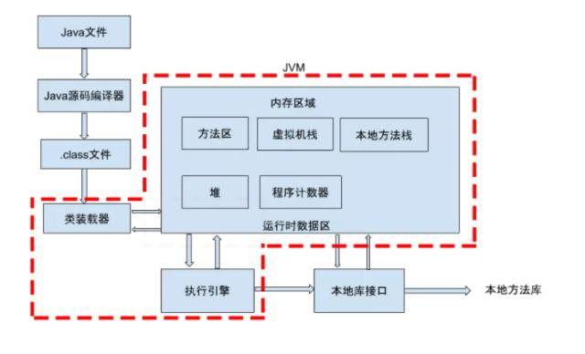
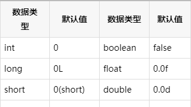
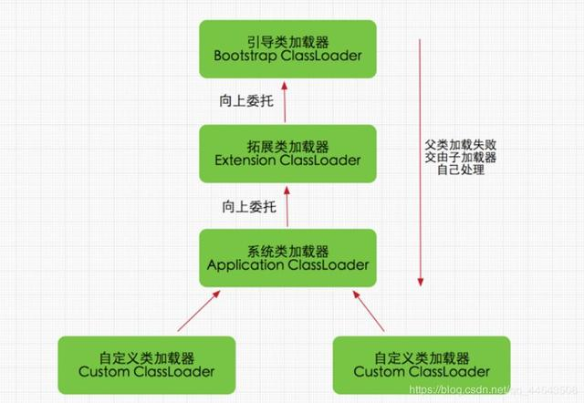
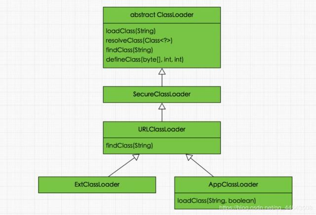

[TOC]
# 一. 什么是类的加载
先看一下，类的加载机制在整个java程序运行期间处于一个什么环节，下面使用一张图来表示：

java文件通过编译器变成了.class文件，接下来类加载器又将这些.class文件加载到JVM中。其中类装载器的作用其实就是类的加载。
> 类的加载指的是将类的.class文件中的二进制数据读入到内存中，将其放在运行时数据区的方法区内，然后在堆区创建一个 `java.lang.Class`对象，用来封装类在方法区内的数据结构。

## 1. 在什么时候才会启动类加载器？

其实，类加载器并不需要等到某个类被“首次主动使用”时再加载它，JVM规范允许类加载器在预料某个类将要被使用时就预先加载它，

如果在预先加载的过程中遇到了.class文件缺失或存在错误，

类加载器必须在程序首次主动使用该类时才报告错误（LinkageError错误）

如果这个类一直没有被程序主动使用，那么类加载器就不会报告错误。

## 2. 从哪个地方去加载.class文件

在这里进行一个简单的分类。例举了5个来源:

* 本地磁盘

* 网上加载.class文件（Applet）

* 从数据库中

* 压缩文件中（ZAR，jar等）

* 从其他文件生成的（JSP应用）

# 二. 类加载的过程
类从被加载到虚拟机内存中开始，到卸载出内存为止，它的整个生命周期包括：`加载、验证、准备、解析、初始化、使用和卸载`七个阶段。它们的顺序如下图所示：


其中类加载的过程包括了加载、验证、准备、解析、初始化五个阶段。在这五个阶段中，加载、验证、准备和初始化这四个阶段开始的顺序是确定的，而解析阶段则不一定，它在某些情况下可以在初始化阶段之后开始。另外注意这里的几个阶段是**按顺序开始，而不是按顺序进行或完成**，因为这些阶段通常都是**互相交叉地混合进行的**，通常在一个阶段执行的过程中调用或激活另一个阶段。

## 1. 加载

”加载“是”类加机制”的第一个过程，在加载阶段，虚拟机主要完成三件事：

1. 通过一个类的全限定名来获取其定义的二进制字节流

2. 将这个字节流所代表的的静态存储结构转化为方法区的运行时数据结构

3. 在堆中生成一个代表这个类的Class对象，作为方法区中这些数据的访问入口。

相对于类加载的其他阶段而言，加载阶段是可控性最强的阶段，因为程序员可以使用系统的类加载器加载，还可以使用自己的类加载器加载。我们在最后一部分会详细介绍这个类加载器。在这里我们只需要知道类加载器的作用就是上面虚拟机需要完成的三件事，仅此而已就好了。

## 2. 验证

验证的主要作用就是确保被加载的类的正确性。也是连接阶段的第一步。说白了也就是我们加载好的.class文件不能对我们的虚拟机有危害，所以先检测验证一下。他主要是完成四个阶段的验证：

1. 文件格式的验证：验证.class文件字节流是否符合class文件的格式的规范，并且能够被当前版本的虚拟机处理。这里面主要对魔数、主版本号、常量池等等的校验。

2. 元数据验证：主要是对字节码描述的信息进行语义分析，以保证其描述的信息符合java语言规范的要求，比如说验证这个类是不是有父类，类中的字段方法是不是和父类冲突等等。

3. 字节码验证：这是整个验证过程最复杂的阶段，主要是通过数据流和控制流分析，确定程序语义是合法的、符合逻辑的。在元数据验证阶段对数据类型做出验证后，这个阶段主要对类的方法做出分析，保证类的方法在运行时不会做出威海虚拟机安全的事。

4. 符号引用验证：它是验证的最后一个阶段，发生在虚拟机将符号引用转化为直接引用的时候。主要是对类自身以外的信息进行校验。目的是确保解析动作能够完成。

对整个类加载机制而言，验证阶段是一个很重要但是非必需的阶段，如果我们的代码能够确保没有问题，那么我们就没有必要去验证，毕竟验证需要花费一定的的时间。当然我们可以使用-Xverfity:none来关闭大部分的验证。

## 3. 准备

准备阶段主要为类变量分配内存并设置初始值。这些内存都在方法区分配。在这个阶段我们只需要注意两点就好了，也就是类变量和初始值两个关键词：

1. 类变量（static）会分配内存，但是实例变量不会，实例变量主要随着对象的实例化一块分配到java堆中，

2. 这里的初始值指的是数据类型默认值，而不是代码中被显示赋予的值。比如

`public static int value = 1;` 在这里准备阶段过后的value值为0，而不是1。赋值为1的动作在初始化阶段。

当然还有其他的默认值。

注意，在上面value是被static所修饰的准备阶段之后是0，但是如果**同时被final和static修饰准备阶段之后就是1了**。我们可以理解为`static final`在编译期就将结果放入调用它的类的常量池中了。

## 4. 解析

解析阶段主要是虚拟机**将常量池中的符号引用转化为直接引用的过程**。什么是符号应用和直接引用呢？

* 符号引用：以一组符号来描述所引用的目标，可以是任何形式的字面量，只要是能无歧义的定位到目标就好，就好比在班级中，老师可以用张三来代表你，也可以用你的学号来代表你，但无论任何方式这些都只是一个代号（符号），这个代号指向你（符号引用）

* 直接引用：直接引用是可以指向目标的指针、相对偏移量或者是一个能直接或间接定位到目标的句柄。和虚拟机实现的内存有关，不同的虚拟机直接引用一般不同。

解析动作主要针对类或接口、字段、类方法、接口方法、方法类型、方法句柄和调用点限定符7类符号引用进行。


## 5. 初始化

这是类加载机制的最后一步，在这个阶段，java程序代码才开始真正执行。我们知道，在准备阶段已经为类变量赋过一次值。在初始化阶端，程序员可以根据自己的需求来赋值了。**一句话描述这个阶段就是执行类构造器< clinit >()方法的过程。**

在初始化阶段，为类的静态变量赋予正确的初始值。

JVM负责对类进行初始化，主要对类变量进行初始化。在Java中对类变量进行初始值设定有两种方式：

* 声明类变量时指定初始值

* 使用静态初始化块为类变量指定初始值

### JVM初始化步骤

1. 假如这个类还没有被加载和连接，则程序先加载并连接该类

2. 假如该类的直接父类还没有被初始化，则先初始化其直接父类

3. 假如类中有初始化语句，则系统依次执行这些初始化语句

### 类初始化时机：只有当对类的主动使用的时候才会导致类的初始化，类的主动使用包括以下六种：

* 创建类的实例，也就是new的方式

* 访问某个类或接口的静态变量，或者对该静态变量赋值

* 调用类的静态方法

* 反射（如 `Class.forName(“com.shengsiyuan.Test”)`）

* 初始化某个类的子类，则其父类也会被初始化

* Java虚拟机启动时被标明为启动类的类（ JavaTest），直接使用 java.exe命令来运行某个主类

# 三. 类加载器
虚拟机设计团队把加载动作放到JVM外部实现，以便让应用程序决定如何获取所需的类。
## 1. Java语言系统自带有三个类加载器:
* `Bootstrap ClassLoader` ：最顶层的加载类，**主要加载核心类库**，也就是我们环境变量下面`%JRE_HOME%\lib`下的rt.jar、resources.jar、charsets.jar和class等。另外需要注意的是可以通过启动jvm时指定-Xbootclasspath和路径来改变Bootstrap ClassLoader的加载目录。比如java -Xbootclasspath/a:path被指定的文件追加到默认的bootstrap路径中。我们可以打开我的电脑，在上面的目录下查看，看看这些jar包是不是存在于这个目录。

* `Extention ClassLoader`(JKD1.9之后为`PlatformClassLoader`) ：扩展的类加载器，加载目录`%JRE_HOME%\lib\ext`目录下的jar包和class文件。还可以加载`-D java.ext.dirs`选项指定的目录。JKD1.9之后不再允许通过将jar文件拷贝到ext目录来加载。

* Appclass Loader：也称为SystemAppClass。 加载当前应用的classpath的所有类。

加载顺序:
```shell
Bootstrap ClassLoader > Extention ClassLoader > Appclass Loader
```


从代码层面了解几个Java中定义的类加载器及其双亲委派模式的实现，它们类图关系如下：


验证代码：
```java
//JDK13
public  void testClassLoader(){
    ClassLoader loader = Thread.currentThread().getContextClassLoader();
    System.out.println(loader);
    System.out.println(loader.getParent());
    System.out.println(loader.getParent().getParent());
}
```
结果：
```shell
jdk.internal.loader.ClassLoaders$AppClassLoader@3d4eac69
jdk.internal.loader.ClassLoaders$PlatformClassLoader@6e2c9341
null
```
从上面的结果可以看出，并没有获取到ExtClassLoader的父Loader，原因是Bootstrap Loader（引导类加载器）是用C语言实现的，找不到一个确定的返回父Loader的方式，于是就返回null。
## 2. 类加载的三种方式

1. 静态加载，也就是通过new关键字来创建实例对象；

2. 动态加载，也就是通过Class.forName()方法动态加载，然后调用类的newInstance()方法实例化对象，会默认执行初始化块（`static{}`），但是`Class.forName(name,initialize,loader)`中的initialze可指定是否要执行初始化块。

3. 动态加载,通过`ClassLoader.loadClass()`方法动态加载，然后调用类的newInstance()方法实例化对象，不会执行初始化块。

**三种类加载方式的区别：**
1. 第一种和第二种方式使用的类加载器是相同的，都是当前类加载器。（this.getClass.getClassLoader）。而3由用户指定类加载器，第3种即为自定义类加载器。

2. 如果需要在当前类路径以外寻找类，则只能采用第3种方式。第3种方式加载的类与当前类分属不同的**命名空间**。

通过代码演示一下：
```java
public class FDD {
    static {
        System.out.println("我是静态代码块。。。。");
    }
}
```
使用不同方式进行加载：
```java
package com.fdd.test;

public class FDDloaderTest {
    public static void main(String[] args) throws ClassNotFoundException {
        ClassLoader loader = HelloWorld.class.getClassLoader();
        System.out.println(loader);
        //一、 使用ClassLoader.loadClass()来加载类，不会执行初始化块 
        loader.loadClass("Fdd");
        //二、 使用Class.forName()来加载类，默认会执行初始化块 
        Class.forName("Fdd");
        //三、使用Class.forName()来加载类，指定ClassLoader，初始化时不执行静态块
        Class.forName("Fdd", false, loader);
    }
}

```
### 关于命名空间
* 每个类加载器有一个自己的命名空间，由其以及其父加载器组成，由不同的类装载器装载的类将被放在虚拟机内部的不同命名空间。

* 在每个类加载器自己的命名空间中不能出现相同类名的类 (此处值得是类的全名，包含包名)

* 因为可以通过创建多个类装载器从而在一个JAVA应用程序中创建多个命名空间，在不同的类命名空间中，可能会出现多个相同的类名的类。

* 命名空间有助于安全的实现，因为你可以有效地在装入了不同命名空间的类之间设置一个防护罩。在JAVA虚拟机中，在同一个命名空间内的类可以直接进行交互，而不同的命名空间中的类甚至不能觉察彼此的存在，除非显示地提供了允许它们进行交互的机制，如获取Class对象的引用后使用反射来访问。

* 虚拟机会为每一个类装载器维护一张列表，列表中是已经被请求过的类型的名字。这些列表包含了每一个类装载器被标记为初始类装载器的类型，它们代表了每一个类装载器的命名空间。虚拟机总是会在调用loadClass()之前检查这个内部列表，如果这个类装载器已经被标记为是这个具有该全限定名的类型的初始类装载器，就会返回表示这个类型的Class实例，这样，**虚拟机永远不会自动在同一个用户自定义类装载器上调用同一个名字的类型两次。**

### 关于命名空间的类型共享
前面提到过只有同一个命名空间内的类才可以直接进行交互，但是我们经常在由用户自定义类装载器定义的类型中直接使用JAVA API类，这不是矛盾了吗？这是**类型共享**的原因－**如果某个类装载器把类型装载的任务委派给另外一个类装载器，而后者定义了这个类型，那么被委派的类装载器装载的这个类型，在所有被标记为该类型的初始类装载器的命名空间中共享。**

**示例：**
现在假设要求Cindy去装载一个名为java.io.FileReader的类型。Cindy第一件事情就是去找Mom来装载那个类型；Mom所做的第一件事情就是去找Grandma来装载那个类型；而Grandma首先去找启动类装载器去装载。在这个例子中，启动类装载器可以装载那个类型，它就返回代表java.io.FileReader的Class实例给Grandma。Grandma传递该Class的引用 Mom，Mom再回传给Cindy，Cindy返回给程序。


例如上面的例子中，Cindy可以共享Mon、Grandma、Bootstrap类装载器的命名空间中的类型，Kenny也可以共享 Mon、Grandma、启动类装载器的命名空间中的类型，但是Cindy和Kenny的命名空间不能共享。

### 关于初始类加载器和定义类加载器
* 如果要求某个类装载器去装载一个类型，但是却返回了其他类装载器装载的类型，这种装载器被称为是那个类型的初始类装载器 ；

* 而实际装载那个类型的类装载器被称为该类型的定义类装载器 。

* 任何被要求装载类型，并且能够返回Class实例的引用代表这个类型的类装载器，都是这个类型的初始类装载器。

* 在上面的一个例子中，java.io.FileReader定义类装载器是Bootstrap类装载器，Cindy、Mom、Grandma、Bootstrap类装载器都是初始类装载器。

### 运行时包
每个类装载器都有自己的命名空间，其中维护着由它装载的类型。所以一个JAVA程序可以多次装载具有同一个全限定名的多个类型。这样一个类型的全限定名就不足以确定在一个JAVA虚拟机中的唯一性。因此，当多个类装载器都装载了同名的类型时，为了唯一表示该类型，还要在类型名称前加上装载该类型的类装载器来表示－[classloader class]。

  在允许两个类型之间对包内可见的成员进行访问前，**虚拟机不但要确定这个两个类型属于同一个包，还必须确认它们属于同一个运行时包－它们必须有同一个类装载器装载的**。这样，java.lang.Virus和来自核心的java.lang的类不属于同一个运行时包，java.lang.Virus就不能访问JAVA API的java.lang包中的包内可见的成员。

## 3. 双亲委派原则
1. **工作流程**是： 当一个类加载器收到类加载任务，会先交给其父类加载器去完成，因此最终加载任务都会传递到顶层的启动类加载器，只有当父类加载器无法完成加载任务时，才会尝试执行加载任务。

2. **采用双亲委派的一个好处**是比如加载位于rt.jar包中的类java.lang.Object，不管是哪个加载器加载这个类，最终都是委托给顶层的启动类加载器进行加载，这样就保证了使用不同的类加载器最终得到的都是同样一个Object对象。

**双亲委派原则归纳一下就是：**

* 可以避免重复加载，父类已经加载了，子类就不需要再次加载

* 更加安全，很好的解决了各个类加载器的基础类的统一问题，如果不使用该种方式，那么用户可以随意定义类加载器来加载核心api，会带来相关隐患。

## 4. 自定义类加载器
**如何自定义类加载器有两种方式:**

1. 遵守双亲委派模型：继承ClassLoader，重写findClass()方法。
   为什么要继承 ClassLoader 这个抽象类，而不继承 AppClassLoader 呢？
   因为它和 ExtClassLoader 都是 Launcher 的静态内部类，其访问权限是缺省的包访问权限。
   `static class AppClassLoader extends URLClassLoader{...}`

2. 破坏双亲委派模型：继承ClassLoader,重写`loadClass()`方法。 JDK 的 `loadCalss()` 方法在所有父类加载器无法加载的时候，会调用本身的 `findClass()` 方法来进行类加载，因此我们只需重写 `findClass()` 方法找到类的二进制数据即可。通常我们推荐采用第一种方法自定义类加载器，最大程度上的遵守双亲委派模型。


首先是需要被加载的简单类：
```java
// 存放于D盘根目录
public class Test {

    public static void main(String[] args) {
        System.out.println("Test类已成功加载运行！");
        ClassLoader classLoader = Test.class.getClassLoader();
        System.out.println("加载我的classLoader：" + classLoader);
        System.out.println("classLoader.parent：" + classLoader.getParent());
    }
}
```
并使用 `javac -encoding utf8 Test.java` 编译成 `Test.class` 文件。
**类加载器实现步骤**
1. 创建一个类继承ClassLoader抽象类

2. 重写findClass()方法

3. 在`findClass()`方法中调用`defineClass()`

**代码实现一下：**
```java
import java.io.*;

public class MyClassLoader extends ClassLoader {
    @Override
    protected Class<?> findClass(String name) throws ClassNotFoundException {
        // 加载D盘根目录下指定类名的class
        String clzDir = "D:\\" + File.separatorChar
                + name.replace('.', File.separatorChar) + ".class";
        byte[] classData = getClassData(clzDir);

        if (classData == null) {
            throw new ClassNotFoundException();
        } else {
            return defineClass(name, classData, 0, classData.length);
        }
    }

    private byte[] getClassData(String path) {
        try (InputStream ins = new FileInputStream(path);
             ByteArrayOutputStream baos = new ByteArrayOutputStream()
        ) {

            int bufferSize = 4096;
            byte[] buffer = new byte[bufferSize];
            int bytesNumRead = 0;
            while ((bytesNumRead = ins.read(buffer)) != -1) {
                baos.write(buffer, 0, bytesNumRead);
            }
            return baos.toByteArray();
        } catch (IOException e) {
            e.printStackTrace();
        }
        return null;
    }
}
```
使用类加载器加载调用 Test 类：
```java
public class MyClassLoaderTest {
    public static void main(String[] args) throws Exception {
        // 指定类加载器加载调用
        MyClassLoader classLoader = new MyClassLoader();
        classLoader.loadClass("Test").getMethod("test").invoke(null);
    }
}
```
输出信息：
```shell
Test.test()已成功加载运行！
加载我的classLoader：class MyClassLoader
classLoader.parent：class sun.misc.Launcher$AppClassLoader
```

## 5. 线程上下文类加载器
**为解决基础类无法调用类加载器加载用户提供代码的问题**，Java 引入了线程上下文类加载器（`Thread Context ClassLoader`）。这个类加载器默认就是 Application 类加载器(AppClassLoader)，并且可以通过 `java.lang.Thread.setContextClassLoaser()`
方法进行设置。

```java
// Now create the class loader to use to launch the application
try {
    loader = AppClassLoader.getAppClassLoader(extcl);
} catch (IOException e) {
    throw new InternalError(
"Could not create application class loader" );
}
 
// Also set the context class loader for the primordial thread.
Thread.currentThread().setContextClassLoader(loader);
```
**那么问题来了，我们使用 `ClassLoader.getSystemClassLoader()` 方法也可以获取到 Application 类加载器，使用它就可以加载用户类了，为什么还需要线程上下文类加载器？**

1. 其实直接使用 `getSystemClassLoader()` 方法获取 AppClassLoader 加载类也可以满足一些情况,正常的双亲委派模型中，下层的类加载器可以使用上层父加载器加载的对象，但是上层父类的加载器不可以使用子类加载的对象。而有些时候程序的确需要上层调用下层，这时候就需要线程上下文加载器来处理。

2. 例如Tomcat 使用的线程上下文类加载器并非 AppClassLoader ，而是 Tomcat 自定义类加载器。自定义类加载器低于AppClassLoader，Tomcat中每个 Web 应用都有一个对应的类加载器实例，该类加载器使用代理模式，首先尝试去加载某个类，如果找不到再代理给父类加载器，这与一般类加载器的顺序是相反的。这是 Java Servlet 规范中的推荐做法，**其目的是使得 Web 应用自己的类的优先级高于 Web 容器提供的类。**

3. 使用线程上下文类加载器，可以在执行线程中抛弃双亲委派加载链模式，使用线程上下文里的类加载器加载类。

4. 使用线程上下文类加载器，这通常发生在JVM核心代码必须动态加载由应用程序动态提供的资源时。拿JNDI为例，它的核心是由JRE核心类(rt.jar)实现的。但这些核心JNDI类必须能加载由第三方厂商提供的JNDI实现。这种情况下需要调用父类加载器（原初类加载器）来加载只有其子类加载器可见的类，即需要用上层父类的加载器来使用子类加载的对象，违背了双亲委派模型。解决办法就是让核心JNDI类使用线程上下文类加载器，从而有效的打通类加载器层次结构，逆着代理机制的方向使用类加载器。


# 四. new一个对象过程中发生了什么？
new一个对象就可以分为两个过程：加载并初始化类和创建对象。

## 1. 类加载过程（第一次使用该类）
见上
## 2. 创建对象
1. 在堆区分配对象需要的内存

分配的内存包括本类和父类的所有实例变量，但不包括任何静态变量

2. 对所有实例变量赋默认值

将方法区内对实例变量的定义拷贝一份到堆区，然后赋默认值

3. 执行实例初始化代码

初始化顺序是先初始化父类再初始化子类，初始化时先执行实例代码块然后是构造方法

4. 如果有类似于`Child c = new Child()`形式的c引用的话，在栈区定义Child类型引用变量c，然后将堆区对象的地址赋值给它

需要注意的是，每个子类对象持有父类对象的引用，可在内部通过super关键字来调用父类对象，但在外部不可访问
