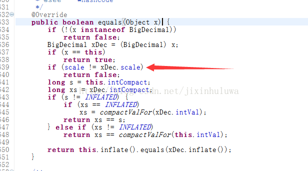

[TOC]
# 1.引言

float和double类型的主要设计目标是为了科学计算和工程计算。

执行二进制浮点运算，这是为了在广域数值范围上提供较为精确的快速近似计算而精心设计的。

然而，它们没有提供完全精确的结果，所以不应该被用于要求精确结果的场合。

但是，商业计算往往要求结果精确，这时候BigDecimal就派上大用场啦。


**先看下面代码:**
```java
public static void main(String[] args)
    {
        System.out.println(0.2 + 0.1);
        System.out.println(0.3 - 0.1);
        System.out.println(0.2 * 0.1);
        System.out.println(0.3 / 0.1);
    }
```

运行结果如下:
```log
0.30000000000000004
0.19999999999999998
0.020000000000000004
2.9999999999999996
```
原因在于我们的计算机是二进制的。**浮点数没有办法是用二进制进行精确表示。**

我们的CPU表示浮点数由两个部分组成：指数和尾数，

这样的表示方法一般都会失去一定的精确度，有些浮点数运算也会产生一定的误差。如：2.4的二进制表示并非就是精确的2.4。反而最为接近的二进制表示是 2.3999999999999999。

浮点数的值实际上是由一个特定的数学公式计算得到的。          

其实java的float只能用来进行科学计算或工程计算，

在大多数的商业计算中，一般采用java.math.BigDecimal类来进行精确计算。


# 2. BigDecimal构造方法

1. `public BigDecimal(double val)` 将double表示形式转换为BigDecimal //不建议使用　　

2. `public BigDecimal(int val)` 将int表示形式转换成BigDecimal　　

3. `public BigDecimal(String val)` 将String表示形式转换成BigDecimal

为什么**不建议采用第一种构造方法呢**？来看例子
```java
public static void main(String[] args)
    {
        BigDecimal bigDecimal = new BigDecimal(2);
        BigDecimal bDouble = new BigDecimal(2.3);
        BigDecimal bString = new BigDecimal("2.3");
        System.out.println("bigDecimal=" + bigDecimal);
        System.out.println("bDouble=" + bDouble);
        System.out.println("bString=" + bString);
    }
```

运行结果如下:
```log
bigDecimal=2
bDouble=2.29999999999999982236431605997495353221893310546875
bString=2.3
```

为什么会出现这种情况呢？ 
JDK的描述：
1. 参数类型为double的构造方法的结果有一定的不可预知性。

有人可能认为在Java中写入newBigDecimal(0.1)所创建的BigDecimal正好等于 0.1（非标度值 1，其标度为 1），但是它实际上等于0.1000000000000000055511151231257827021181583404541015625。

这是因为0.1无法准确地表示为 double（或者说对于该情况，不能表示为任何有限长度的二进制小数）。

这样，传入到构造方法的值不会正好等于 0.1（虽然表面上等于该值）。       

2. 另一方面，String 构造方法是完全可预知的：写入 newBigDecimal("0.1") 将创建一个 BigDecimal，它正好等于预期的 0.1。因此，比较而言，**通常建议优先使用String构造方法。**

3. 当double必须用作BigDecimal的源时，请使用`Double.toString(double)` 转成String，然后使用String构造方法，或使用BigDecimal的静态方法valueOf，如下:
```java
public static void main(String[] args)
    {
        BigDecimal bDouble1 = BigDecimal.valueOf(2.3);
        BigDecimal bDouble2 = new BigDecimal(Double.toString(2.3));

        System.out.println("bDouble1=" + bDouble1);
        System.out.println("bDouble2=" + bDouble2);
        
    }
```
结果如下：
```log
bDouble1=2.3
bDouble2=2.3
```
# 3. BigDecimal加减乘除运算

对于常用的加，减，乘，除，BigDecimal类提供了相应的成员方法。

```java
public BigDecimal add(BigDecimal value);                        //加法

public BigDecimal subtract(BigDecimal value);                   //减法 

public BigDecimal multiply(BigDecimal value);                   //乘法

public BigDecimal divide(BigDecimal value);                     //除法
```
大概用法如下：
```java
public static void main(String[] args)
    {
        BigDecimal a = new BigDecimal("4.5");
        BigDecimal b = new BigDecimal("1.5");

        System.out.println("a + b =" + a.add(b));
        System.out.println("a - b =" + a.subtract(b));
        System.out.println("a * b =" + a.multiply(b));
        System.out.println("a / b =" + a.divide(b));
    }
```
结果：
```log
a + b =6.0
a - b =3.0
a * b =6.75
a / b =3
```
### 需要注意的是除法运算divide.

 BigDecimal除法可能出现不能整除的情况，比如 4.5/1.3，这时会报错`java.lang.ArithmeticException: Non-terminating decimal expansion; no exact representable decimal result.`
 
其实divide方法有可以传三个参数：
```java
public BigDecimal divide(BigDecimal divisor, int scale, int roundingMode) 
```
第一参数表示除数，
第二个参数表示小数点后保留位数，
第三个参数表示舍入模式，只有在作除法运算或四舍五入时才用到舍入模式，有下面这几种:
```java
ROUND_CEILING    //向正无穷方向舍入

ROUND_DOWN    //向零方向舍入

ROUND_FLOOR    //向负无穷方向舍入

ROUND_HALF_DOWN    //向（距离）最近的一边舍入，除非两边（的距离）是相等,如果是这样，向下舍入, 例如1.55 保留一位小数结果为1.5

ROUND_HALF_EVEN    //向（距离）最近的一边舍入，除非两边（的距离）是相等,如果是这样，如果保留位数是奇数，使用ROUND_HALF_UP，如果是偶数，使用ROUND_HALF_DOWN

ROUND_HALF_UP    //向（距离）最近的一边舍入，除非两边（的距离）是相等,如果是这样，向上舍入, 1.55保留一位小数结果为1.6.-----四舍五入

ROUND_UNNECESSARY    //计算结果是精确的，不需要舍入模式

ROUND_UP    //向远离0的方向舍入
```

需要对BigDecimal进行截断和四舍五入可用setScale方法，例：
```java
public static void main(String[] args)
    {
        BigDecimal a = new BigDecimal("4.5635");

        a = a.setScale(3, RoundingMode.HALF_UP);    //保留3位小数，且四舍五入
        System.out.println(a);
    }
```

加减乘除其实最终都返回的是一个新的BigDecimal对象。
因为BigInteger与BigDecimal都是不可变的（immutable）的，在进行每一步运算时，都会产生一个新的对象
```java
public static void main(String[] args)
    {
        BigDecimal a = new BigDecimal("4.5");
        BigDecimal b = new BigDecimal("1.5");
        a.add(b);

        System.out.println(a);  //输出4.5. 加减乘除方法会返回一个新的BigDecimal对象，原来的a不变


    }
```
# 4. Bigdecimal类型判断是否等于0（用equals方法的坑）



Bigdecimal的equals方法不仅仅比较值的大小是否相等，

首先比较的是scale（scale是bigdecimal的保留小数点位数，比如 `new Bigdecimal("1.001"),scale为3）`，也就是说，**不但值得大小要相等，保留位数也要相等**，equals才能返回true。

`Bigdecimal b = new Bigdecimal("0") `和 `Bigdecimal c = new Bigdecimal("0.0"),`用equals比较，返回就是false。

**Bigdecimal.ZERO的scale为0.** 所以，用equals方法要注意这一点。


> 用b.compareTo(BigDecimal.ZERO)==0，可以比较是否等于0，返回true则等于0，返回false，则不等于0
