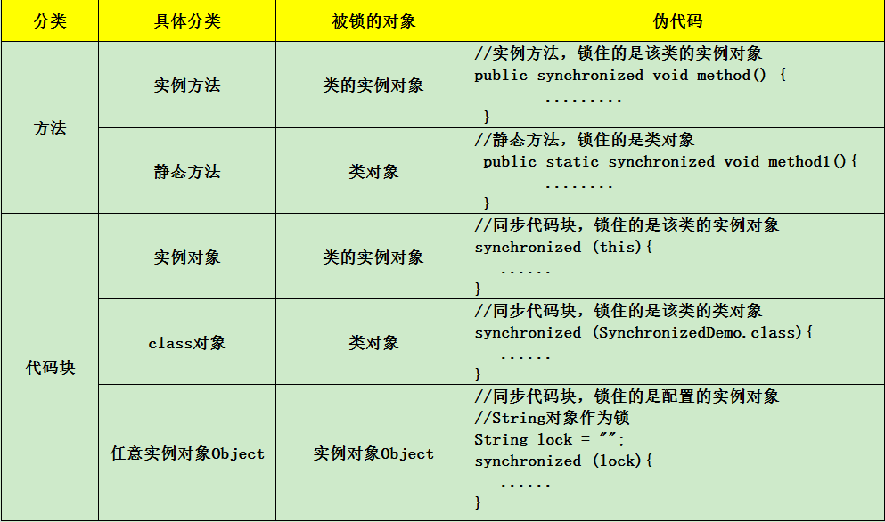
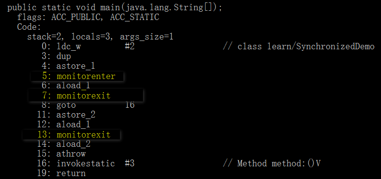
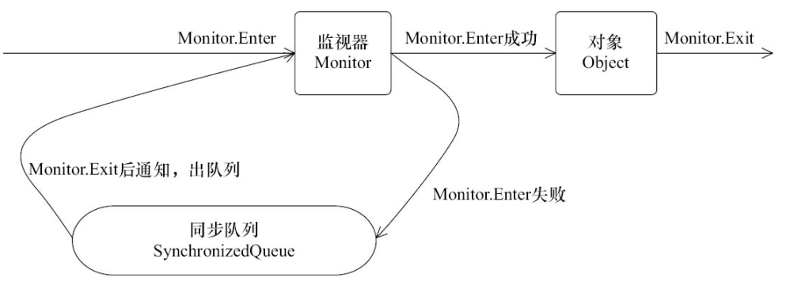
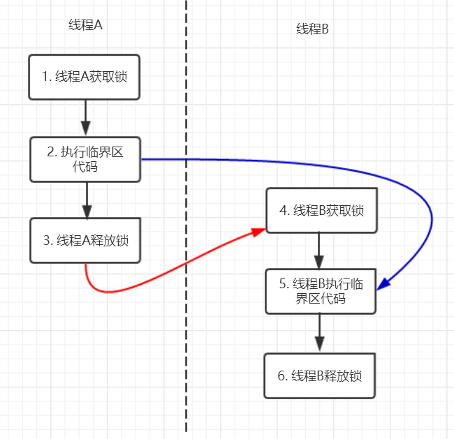
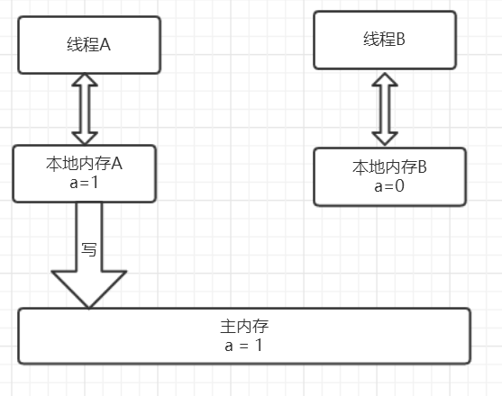
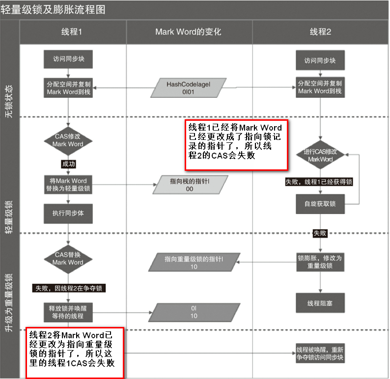
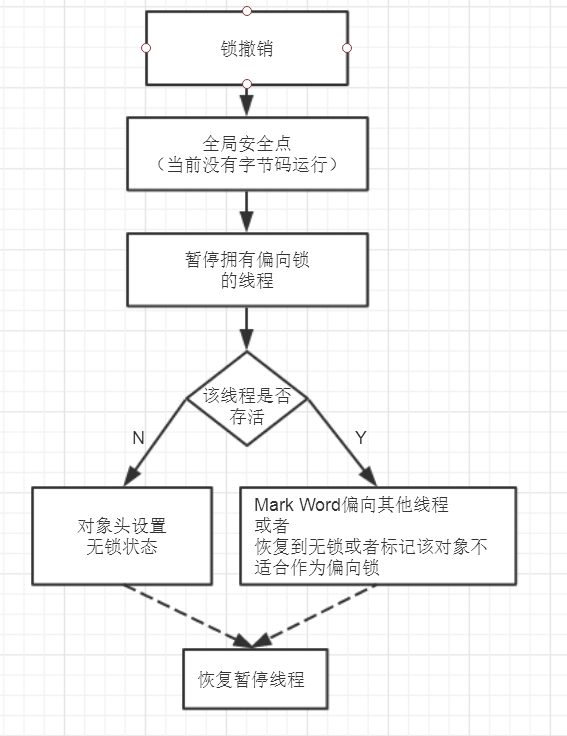
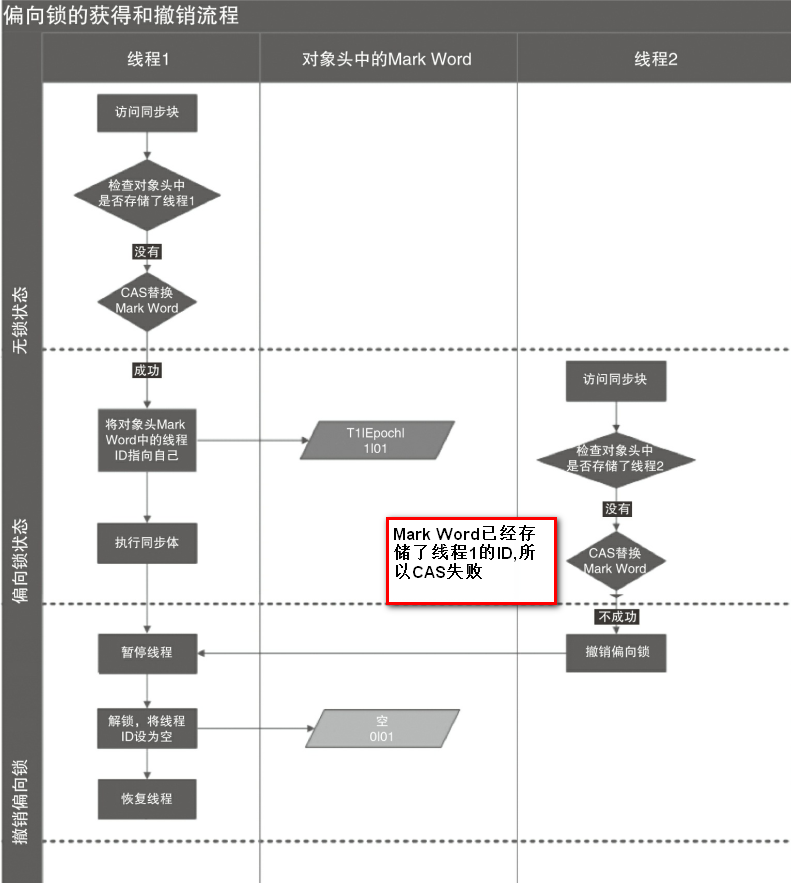
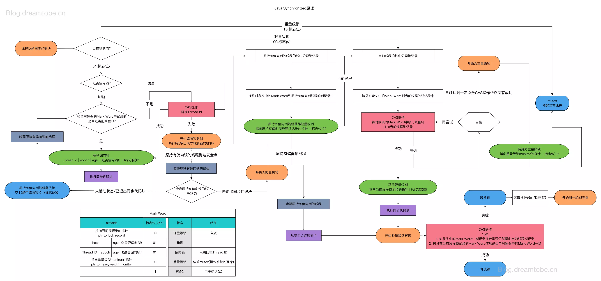
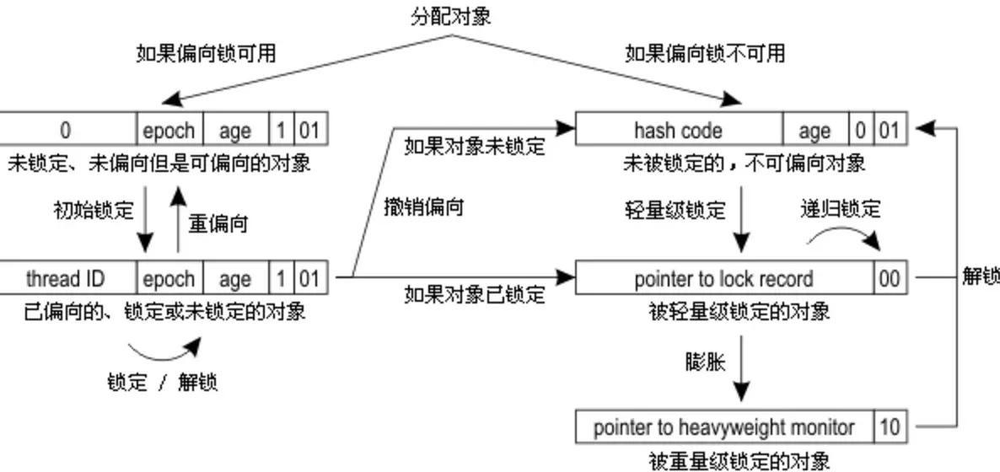

[TOC]
# 1. synchronized简介
在学习知识前，我们先来看一个现象：

```java
public class SynchronizedDemo implements Runnable {
	private static int count = 0;

	public static void main(String[] args) {
		for (int i = 0; i < 10; i++) {
			Thread thread = new Thread(new SynchronizedDemo());
			thread.start();
		}
		try {
			Thread.sleep(500);
		} catch (InterruptedException e) {
			e.printStackTrace();
		}
		System.out.println("result: " + count);
	}

	@Override
	public void run() {
		for (int i = 0; i < 1000000; i++)
			count++;
	}
}
```
开启了10个线程，每个线程都累加了1000000次，如果结果正确的话自然而然总数就应该是10 * 1000000 = 10000000。可就运行多次结果都不是这个数，而且每次运行结果都不一样。这是为什么了？有什么解决方案了？这就是我们今天要聊的事情。

# 2. synchronized实现原理
在java代码中使用synchronized可是使用在代码块和方法中，根据Synchronized用的位置可以有这些使用场景：



如图，synchronized可以用在方法上也可以使用在代码块中，其中方法是实例方法和静态方法分别锁的是该类的实例对象和该类的对象。而使用在代码块中也可以分为三种，具体的可以看上面的表格。这里的需要注意的是：如果锁的是类对象的话，尽管new多个实例对象，但他们仍然是属于同一个类依然会被锁住，即线程之间保证同步关系。

* **修饰实例方法，作用于当前对象实例加锁，进入同步代码前要获得当前对象实例的锁**

* **修饰静态方法，作用于当前类对象加锁，进入同步代码前要获得当前类对象的锁** 。也就是给当前类加锁，**会作用于类的需要访问这个静态方法的所有对象实例**，因为静态成员不属于任何一个实例对象，是类成员（ static 表明这是该类的一个静态资源，不管new了多少个对象，只有一份，所以对该类的所有对象都加了锁）。但**如果一个线程A调用一个实例对象的非静态 synchronized 方法，而线程B需要调用这个实例对象所属类的静态 synchronized 方法，是允许的，不会发生互斥现象，因为访问静态 synchronized 方法占用的锁是当前类的锁，而访问非静态 synchronized 方法占用的锁是当前实例对象锁。另外也可以同时获得对象锁和类锁**

* **修饰代码块，指定加锁对象，对给定对象加锁，进入同步代码库前要获得给定对象的锁。** 和 synchronized 方法一样，synchronized(this)代码块也是锁定当前对象的。synchronized 关键字加到 static 静态方法和 synchronized(class)代码块上都是是给 Class 类上锁。另外需要注意的是：尽量不要使用 synchronized(String a) 因为JVM中，字符串常量池具有缓冲功能！

## 2.1 对象锁（monitor）机制
现在我们来看看synchronized的具体底层实现。先写一个简单的demo:
```java
public class SynchronizedDemo {
	public static void main(String[] args) {
		synchronized (SynchronizedDemo.class) {
		}
		method();
	}

	private static void method() {
	}
}
```
上面的代码中有一个同步代码块，锁住的是类对象，并且还有一个同步静态方法，锁住的依然是该类的类对象。编译之后，切换到SynchronizedDemo.class的同级目录之后，然后用 `javap -v SynchronizedDemo.class` 查看字节码文件：


如图，上面用黄色高亮的部分就是需要注意的部分了，这也是添加Synchronized关键字之后独有的。执行同步代码块后首先要先执行 `monitorenter`指令，退出的时候执行 `monitorexit ` 指令。

通过分析之后可以看出，使用Synchronized进行同步，其关键就是必须要对对象的监视器monitor进行获取，当线程获取monitor后才能继续往下执行，否则就只能等待。

而这个获取的过程是互斥的，即同一时刻只有一个线程能够获取到monitor。

上面的demo中在执行完同步代码块之后紧接着再会去执行一个静态同步方法，而这个方法锁的对象依然锁定这个类对象（因为锁定的是类对象，执行method()方法时依旧是通过类对象去调用的，所以这是对method()方法依旧是锁定的），那么这个正在执行的线程还需要获取该锁吗？

答案是不必的，从上图中就可以看出来，执行静态同步方法的时候就只有一条monitorexit指令，并没有monitorenter获取锁的指令。

这就是**锁的重入性**，即在同一锁程中，线程不需要再次获取同一把锁。Synchronized先天具有重入性。每个对象拥有一个计数器，当线程获取该对象锁后，计数器就会加一，释放锁后就会将计数器减一。

> 锁的可重入性
> * “可重入锁”概念是：自己可以再次获取自己的内部锁。比如一个线程获得了某个对象的锁，此时这个对象锁还没有释放，当其再次想要获取这个对象的锁的时候还是可以获取的，如果不可锁重入的话，就会造成死锁。
> * 当存在父子类继承关系时，子类是完全可以通过“可重入锁”调用父类的同步方法。

> synchronized关键字不可继承
> * 如果父类有一个带synchronized关键字的方法，子类继承并重写了这个方法。但是同步不能继承，所以还是需要在子类方法中添加synchronized关键字。

任意一个对象都拥有自己的监视器，当这个对象由同步块或者这个对象的同步方法调用时，执行方法的线程必须先获取该对象的监视器才能进入同步块和同步方法，如果没有获取到监视器的线程将会被阻塞在同步块和同步方法的入口处，进入到BLOCKED状态。

下图表现了对象，对象监视器，同步队列以及执行线程状态之间的关系：


该图可以看出，任意线程对Object的访问，

首先要获得Object的监视器，

如果获取失败，该线程就进入同步状态，线程状态变为BLOCKED，

当Object的监视器占有者释放后，在同步队列中得线程就会有机会重新获取该监视器。

## 2.2 synchronized的happens-before关系
Synchronized的happens-before规则，即监视器锁规则：

**对同一个监视器的解锁，happens-before于对该监视器的加锁。**

继续来看代码：
```java
public class MonitorDemo {
	private int a = 0;

	public synchronized void writer() { // 1
		a++; // 2
	} // 3

	public synchronized void reader() { // 4
		int i = a; // 5
	} // 6
}
```
该代码的happens-before关系如图所示：


在图中每一个箭头连接的两个节点就代表之间的happens-before关系，

黑色的是通过程序顺序规则推导出来，

红色的为通过监视器锁规则推导而出：线程A释放锁happens-before线程B加锁，

蓝色的则是通过程序顺序规则和监视器锁规则推测出来happens-before关系，通过传递性规则进一步推导的happens-before关系。

现在我们来重点关注2 happens-before 5，通过这个关系我们可以得出什么？

根据happens-before的定义中的一条:如果A happens-before B，则A的执行结果对B可见，并且A的执行顺序先于B。线程A先对共享变量A进行加一，由2 happens-before 5关系可知线程A的执行结果对线程B可见即线程B所读取到的a的值为1。

## 2.3 锁获取和锁释放的内存语义
基于java内存抽象模型的Synchronized的内存语义。


从上图可以看出，线程A会首先从主内存中读取共享变量a=0的值，然后将该变量拷贝到自己的本地内存，进行加一操作后，再将该值刷新到主内存，整个过程即为线程A 加锁-->执行临界区代码-->释放锁相对应的内存语义。


线程B获取锁的时候同样会从主内存中共享变量a的值，这个时候就是最新的值1,然后将该值拷贝到线程B的工作内存中去，释放锁的时候同样会重写到主内存中。

从整体上来看，线程A的执行结果（a=1）对线程B是可见的，实现原理为：释放锁的时候会将值刷新到主内存中，其他线程获取锁时会强制从主内存中获取最新的值。另外也验证了2 happens-before 5，2的执行结果对5是可见的。

从横向来看，这就像线程A通过主内存中的共享变量和线程B进行通信，A 告诉 B 我们俩的共享数据现在为1啦，这种线程间的通信机制正好吻合java的内存模型正好是共享内存的并发模型结构。

# 3. synchronized优化
在 Java 早期版本中，synchronized 属于**重量级锁**，效率低下，因为监视器锁（monitor）是依赖于底层的操作系统的 Mutex Lock 来实现的，Java 的线程是映射到操作系统的原生线程之上的。如果要挂起或者唤醒一个线程，都需要操作系统帮忙完成，而操作系统实现线程之间的切换时需要从用户态转换到内核态，这个状态之间的转换需要相对比较长的时间，时间成本相对较高，这也是为什么早期的 synchronized 效率低的原因。庆幸的是在 **Java 6 之后 Java 官方对从 JVM 层面对synchronized 较大优化**，所以现在的 synchronized 锁效率也优化得很不错了。JDK1.6对锁的实现引入了大量的优化，如自旋锁、适应性自旋锁、锁消除、锁粗化、偏向锁、轻量级锁等技术来减少锁操作的开销。

## 3.1 CAS操作
### 3.1.1 什么是CAS?
使用锁时，线程获取锁是一种悲观锁策略，即假设每一次执行临界区代码都会产生冲突，所以当前线程获取到锁的时候同时也会阻塞其他线程获取该锁。

而CAS操作（又称为无锁操作）是一种乐观锁策略，它假设所有线程访问共享资源的时候不会出现冲突，既然不会出现冲突自然而然就不会阻塞其他线程的操作。因此，线程就不会出现阻塞停顿的状态。

那么，如果出现冲突了怎么办？无锁操作是使用CAS(compare and swap)又叫做比较交换来鉴别线程是否出现冲突，出现冲突就重试当前操作直到没有冲突为止。
### 3.1.2 CAS的操作过程
CAS比较交换的过程可以通俗的理解为CAS(V,O,N)，包含三个值分别为：

* V 内存地址存放的实际值；
* O 预期的值（旧值）；
* N 更新的新值。

当V和O相同时，也就是说旧值和内存中实际的值相同表明该值没有被其他线程更改过，即该旧值O就是目前来说最新的值了，自然而然可以将新值N赋值给V。反之，V和O不相同，表明该值已经被其他线程改过了则该旧值O不是最新版本的值了，所以不能将新值N赋给V，返回V即可。

当多个线程使用CAS操作一个变量时，只有一个线程会成功，并成功更新，其余会失败。失败的线程会重新尝试，当然也可以选择挂起线程。

CAS的实现需要硬件指令集的支撑，在JDK1.5后虚拟机才可以使用处理器提供的CMPXCHG指令实现。

> Synchronized VS CAS

1. 元老级的Synchronized(未优化前)最主要的问题是：在存在线程竞争的情况下会出现线程阻塞和唤醒锁带来的性能问题，因为这是一种互斥同步（阻塞同步）。

2. CAS并不是武断的将线程挂起，当CAS操作失败后会进行一定的尝试，而非进行耗时的挂起唤醒的操作，因此也叫做非阻塞同步。这是两者主要的区别。

### 3.1.3 CAS的应用场景
在 `J.U.C(java.util.concurrent)` 包中利用CAS实现类有很多，可以说是支撑起整个concurrency包的实现，在Lock实现中会有CAS改变state变量，在atomic包中的实现类也几乎都是用CAS实现。
### 3.1.4 CAS的问题
#### 1. ABA问题
因为CAS会检查旧值有没有变化，这里存在这样一个有意思的问题。比如一个旧值A变为了成B，然后再变成A，刚好在做CAS时检查发现旧值并没有变化依然为A，但是实际上的确发生了变化。解决方案可以沿袭数据库中常用的乐观锁方式，添加一个版本号可以解决。原来的变化路径A->B->A就变成了1A->2B->3C。java这么优秀的语言，当然在java 1.5后的atomic包中提供了AtomicStampedReference来解决ABA问题，解决思路就是这样的。

#### 2. 自旋时间过长

使用CAS时非阻塞同步，也就是说不会将线程挂起，会自旋（无非就是一个死循环）进行下一次尝试，如果这里自旋时间过长对性能是很大的消耗。如果JVM能支持处理器提供的pause指令，那么在效率上会有一定的提升。

#### 3. 只能保证一个共享变量的原子操作

当对一个共享变量执行操作时CAS能保证其原子性，如果对多个共享变量进行操作,CAS就不能保证其原子性。有一个解决方案是利用对象整合多个共享变量，即一个类中的成员变量就是这几个共享变量。然后将这个对象做CAS操作就可以保证其原子性。atomic中提供了AtomicReference来保证引用对象之间的原子性。


## 3.2 Java对象头

在同步的时候是获取对象的monitor,即获取到对象的锁。那么对象的锁怎么理解？
无非就是类似对对象的一个标志，那么这个标志就是存放在Java对象的对象头。Java对象头里的Mark Word里默认的存放的对象的Hashcode,分代年龄和锁标记位。

32位JVM Mark Word默认存储结构为：


如图在Mark Word会默认存放hasdcode，分代年龄值以及锁标志位等信息。

Java SE 1.6中，锁一共有4种状态，级别从低到高依次是：无锁状态、偏向锁状态、轻量级锁状态和重量级锁状态，这几个状态会随着竞争情况逐渐升级。锁可以升级但不能降级，意味着偏向锁升级成轻量级锁后不能降级成偏向锁。这种锁升级却不能降级的策略，目的是为了提高获得锁和释放锁的效率。对象的MarkWord变化为下图：


### 3.2.1 重量级锁
内置锁在Java中被抽象为监视器锁（monitor）。在JDK 1.6之前，监视器锁可以认为直接对应底层操作系统中的互斥量（mutex）。这种同步方式的成本非常高，包括系统调用引起的内核态与用户态切换、线程阻塞造成的线程切换等。因此，后来称这种锁为“重量级锁”。

### 3.2.2 自旋锁

首先，内核态与用户态的切换上不容易优化。但**通过自旋锁，可以减少线程阻塞造成的线程切换**（包括挂起线程和恢复线程）。

如果锁的粒度小，那么锁的持有时间比较短（尽管具体的持有时间无法得知，但可以认为，通常有一部分锁能满足上述性质）。那么，对于竞争这些锁的而言，因为锁阻塞造成线程切换的时间与锁持有的时间相当，减少线程阻塞造成的线程切换，能得到较大的性能提升。具体如下：

* 当前线程竞争锁失败时，打算阻塞自己

* 不直接阻塞自己，而是自旋（空等待，比如一个空的有限for循环）一会

* 在自旋的同时重新竞争锁

* 如果自旋结束前获得了锁，那么锁获取成功；否则，自旋结束后阻塞自己
 
如果在自旋的时间内，锁就被旧owner释放了，那么当前线程就不需要阻塞自己（也不需要在未来锁释放时恢复），减少了一次线程切换。

“锁的持有时间比较短”这一条件可以放宽。实际上，只要锁竞争的时间比较短（比如线程1快释放锁的时候，线程2才会来竞争锁），就能够提高自旋获得锁的概率。这通常发生在**锁持有时间长，但竞争不激烈**的场景中。

#### 缺点
* 单核处理器上，不存在实际的并行，当前线程不阻塞自己的话，旧owner就不能执行，锁永远不会释放，此时不管自旋多久都是浪费；进而，如果线程多而处理器少，自旋也会造成不少无谓的浪费。

* 自旋锁要占用CPU，如果是计算密集型任务，这一优化通常得不偿失，减少锁的使用是更好的选择。

* 如果锁竞争的时间比较长，那么自旋通常不能获得锁，白白浪费了自旋占用的CPU时间。这通常发生在锁持有时间长，且竞争激烈的场景中，此时应主动禁用自旋锁。

> 使用-XX:-UseSpinning参数关闭自旋锁优化；-XX:PreBlockSpin参数修改默认的自旋次数。

### 3.2.3 自适应自旋锁

自适应意味着自旋的时间不再固定了，而是由前一次在同一个锁上的自旋时间及锁的拥有者的状态来决定：

* 如果在同一个锁对象上，自旋等待刚刚成功获得过锁，并且持有锁的线程正在运行中，那么虚拟机就会认为这次自旋也很有可能再次成功，进而它将允许自旋等待持续相对更长的时间，比如100个循环。

* 相反的，如果对于某个锁，自旋很少成功获得过，那在以后要获取这个锁时将可能减少自旋时间甚至省略自旋过程，以避免浪费处理器资源。


**自适应自旋解决的是“锁竞争时间不确定”的问题**。JVM很难感知到确切的锁竞争时间，而交给用户分析就违反了JVM的设计初衷。自适应自旋假定不同线程持有同一个锁对象的时间基本相当，竞争程度趋于稳定，因此，可以根据上一次自旋的时间与结果调整下一次自旋的时间。

#### 缺点
然而，自适应自旋也没能彻底解决该问题，如果默认的自旋次数设置不合理（过高或过低），那么自适应的过程将很难收敛到合适的值。

### 3.2.4 轻量级锁


自旋锁的目标是降低线程切换的成本。如果锁竞争激烈，我们不得不依赖于重量级锁，让竞争失败的线程阻塞；如果完全没有实际的锁竞争，那么申请重量级锁都是浪费的。

**轻量级锁的目标是，减少无实际竞争情况下，使用重量级锁产生的性能消耗，包括系统调用引起的内核态与用户态切换、线程阻塞造成的线程切换等。**

顾名思义，轻量级锁是相对于重量级锁而言的。使用轻量级锁时，不需要申请互斥量，仅仅将Mark Word中的部分字节CAS更新指向线程栈中的Lock Record，如果更新成功，则轻量级锁获取成功，记录锁状态为轻量级锁；否则，说明已经有线程获得了轻量级锁，目前发生了锁竞争（不适合继续使用轻量级锁），接下来膨胀为重量级锁。

当然，由于轻量级锁天然瞄准不存在锁竞争的场景，如果存在锁竞争但不激烈，仍然可以用自旋锁优化，自旋失败后再膨胀为重量级锁。

> 加锁

线程在执行同步块之前，JVM会先在当前线程的栈桢中**创建用于存储锁记录的空间**，并将对象头中的Mark Word复制到锁记录中，官方称为**Displaced Mark Word**。

然后线程尝试使用CAS将对象头中的Mark Word替换为指向锁记录的指针。

* 如果成功，当前线程获得锁（此时线程将对象头和栈帧中的锁记录里存储锁偏向的线程ID）

* 如果失败，表示其他线程竞争锁，当前线程便尝试使用自旋来获取锁

> 解锁

轻量级解锁时，会使用原子的CAS操作将Displaced Mark Word替换回到对象头，

* 如果成功，则表示没有竞争发生。

* 如果失败，表示当前锁存在竞争，锁就会**膨胀成重量级锁**。下图是两个线程同时争夺锁，导致锁膨胀的流程图。

因为自旋会消耗CPU，为了避免无用的自旋（比如获得锁的线程被阻塞住了），一旦锁升级成重量级锁，就不会再恢复到轻量级锁状态。当锁处于这个状态下，其他线程试图获取锁时，都会被阻塞住，当持有锁的线程释放锁之后会唤醒这些线程，被唤醒的线程就会进行新一轮的夺锁之争。

#### 缺点
同自旋锁相似：
* 如果锁竞争激烈，那么轻量级将很快膨胀为重量级锁，那么维持轻量级锁的过程就成了浪费。

### 3.2.5 偏向锁

* 大多数情况下，**锁不仅不存在多线程竞争，而且总是由同一线程多次获得**，为了让线程获得锁的代价更低而引入了偏向锁。

* 在没有实际竞争的情况下，还能够针对部分场景继续优化。如果不仅仅没有实际竞争，自始至终，使用锁的线程都只有一个，那么，维护轻量级锁都是浪费的。

*  **偏向锁的目标是，减少无竞争且只有一个线程使用锁的情况下，使用轻量级锁产生的性能消耗。** 轻量级锁每次申请、释放锁都至少需要一次CAS，但偏向锁只有初始化时需要一次CAS。

* 偏向”的意思是，偏向锁假定将来只有第一个申请锁的线程会使用锁（不会有任何线程再来申请锁），因此，只需要在Mark Word中CAS记录owner（本质上也是更新，但初始值为空），如果记录成功，则偏向锁获取成功，记录锁状态为偏向锁，以后当前线程等于owner就可以零成本的直接获得锁；否则，说明有其他线程竞争，膨胀为轻量级锁。
* 偏向锁无法使用自旋锁优化，因为一旦有其他线程申请锁，就破坏了偏向锁的假定。

> 偏向锁的获取

当一个线程访问同步块并获取锁时，会在**对象头和栈帧中的锁记录**里存储锁偏向的线程ID，以后该线程在进入和退出同步块时不需要进行CAS操作来加锁和解锁，只需简单地测试一下对象头的Mark Word里是否存储着指向当前线程的偏向锁。

如果测试成功，表示线程已经获得了锁。
如果测试失败，则需要再测试一下Mark Word中偏向锁的标识是否设置成1（表示当前是偏向锁）：

* 如果没有设置，则使用CAS竞争锁；
* 如果设置了，则尝试使用CAS将对象头的偏向锁指向当前线程

> 偏向锁的撤销

**偏向锁使用了一种等到竞争出现才释放锁的机制，所以当其他线程尝试竞争偏向锁时，持有偏向锁的线程才会释放锁。**




如图，偏向锁的撤销，需要等待全局安全点（在这个时间点上没有正在执行的字节码）。

它会首先暂停拥有偏向锁的线程，然后检查持有偏向锁的线程是否活着，

* 如果线程不处于活动状态，则将对象头设置成无锁状态；

* 如果线程仍然活着，拥有偏向锁的栈会被执行。

遍历偏向对象的锁记录，栈中的锁记录和对象头的Mark Word要么重新偏向于其他线程，要么恢复到无锁或者标记对象不适合作为偏向锁，最后唤醒暂停的线程。


下图线程1展示了**偏向锁获取**的过程，线程2展示了**偏向锁撤销**的过程。


> 如何关闭偏向锁
偏向锁在Java 6和Java 7里是默认启用的，但是它在应用程序启动几秒钟之后才激活，如有必要可以使用JVM参数来关闭延迟：-XX:BiasedLockingStartupDelay=0。如果你确定应用程序里所有的锁通常情况下处于竞争状态，可以通过JVM参数关闭偏向锁：-XX:-UseBiasedLocking=false，那么程序默认会进入轻量级锁状态。

#### 缺点
>*  **如果明显存在其他线程申请锁，那么偏向锁将很快膨胀为轻量级锁。**
>*  不过这个副作用已经小的多。如果需要，使用参数-XX:-UseBiasedLocking禁止偏向锁优化（默认打开）。

### 总结


偏向锁、轻量级锁、重量级锁适用于不同的并发场景：

* 偏向锁：无实际竞争，且将来只有第一个申请锁的线程会使用锁。
* 轻量级锁：无实际竞争，多个线程交替使用锁；允许短时间的锁竞争。
* 重量级锁：有实际竞争，且锁竞争时间长。

另外，如果锁竞争时间短，可以使用自旋锁进一步优化轻量级锁、重量级锁的性能，减少线程切换。

如果锁竞争程度逐渐提高（缓慢），那么从偏向锁逐步膨胀到重量锁，能够提高系统的整体性能。

### 3.2.6 锁分配和膨胀过程


特别说明两点：

* CAS记录owner时，expected == null，newValue == ownerThreadId，因此，**只有第一个申请偏向锁的线程能够返回成功，后续线程都必然失败**（部分线程检测到可偏向，同时尝试CAS记录owner）。

* **内置锁只能沿着偏向锁、轻量级锁、重量级锁的顺序逐渐膨胀**，不能“收缩”。这基于JVM的另一个假定，“一旦破坏了上一级锁的假定，就认为该假定以后也必不成立”。

**简化版**



# 4.问题解决
```java
public class SynchronizedDemo implements Runnable {
	private static int count = 0;

	public static void main(String[] args) {
		for (int i = 0; i < 10; i++) {
			Thread thread = new Thread(new SynchronizedDemo());
			thread.start();
		}
		try {
			Thread.sleep(500);
		} catch (InterruptedException e) {
			e.printStackTrace();
		}
		System.out.println("result: " + count);
	}

	@Override
	public void run() {
		synchronized (SynchronizedDemo.class) {
			for (int i = 0; i < 1000000; i++)
				count++;
		}
	}
}
```

# 5. Synchronized 和 ReenTrantLock 的对比
### 5.1 两者都是可重入锁
两者都是可重入锁。“可重入锁”概念是：自己可以再次获取自己的内部锁。比如一个线程获得了某个对象的锁，此时这个对象锁还没有释放，当其再次想要获取这个对象的锁的时候还是可以获取的，如果不可锁重入的话，就会造成死锁。同一个线程每次获取锁，锁的计数器都自增1，所以要等到锁的计数器下降为0时才能释放锁。
### 5.2 synchronized 依赖于 JVM 而 ReenTrantLock 依赖于 API
synchronized 是依赖于 JVM 实现的，前面我们也讲到了 虚拟机团队在 JDK1.6 为 synchronized 关键字进行了很多优化，但是这些优化都是在虚拟机层面实现的，并没有直接暴露给我们。ReenTrantLock 是 JDK 层面实现的（也就是 API 层面，需要 lock() 和 unlock 方法配合 try/finally 语句块来完成），所以我们可以通过查看它的源代码，来看它是如何实现的。
### 5.3 ReenTrantLock 比 synchronized 增加了一些高级功能
相比synchronized，ReenTrantLock增加了一些高级功能。主要来说主要有三点：

1. 等待可中断；ReenTrantLock提供了一种能够中断等待锁的线程的机制，通过lock.lockInterruptibly()来实现这个机制。也就是说正在等待的线程可以选择放弃等待，改为处理其他事情。

2. 可实现公平锁；ReenTrantLock可以指定是公平锁还是非公平锁。而synchronized只能是非公平锁。所谓的公平锁就是先等待的线程先获得锁。 ReenTrantLock默认情况是非公平的，可以通过 ReenTrantLock类的ReentrantLock(boolean fair)构造方法来制定是否是公平的。

3. 可实现选择性通知（锁可以绑定多个条件）
    
    * synchronized关键字与wait()和notify/notifyAll()方法相结合可以实现等待/通知机制，ReentrantLock类当然也可以实现，但是需要借助于Condition接口与newCondition() 方法。
   
     * Condition是JDK1.5之后才有的，它具有很好的灵活性，比如可以实现多路通知功能也就是在一个Lock对象中可以创建多个Condition实例（即对象监视器），线程对象可以注册在指定的Condition中，从而可以有选择性的进行线程通知，在调度线程上更加灵活。 
    
    * 在使用notify/notifyAll()方法进行通知时，被通知的线程是由 JVM 选择的，用ReentrantLock类结合Condition实例可以实现“选择性通知” ，这个功能非常重要，而且是Condition接口默认提供的。
    
    * 而synchronized关键字就相当于整个Lock对象中只有一个Condition实例，所有的线程都注册在它一个身上。如果执行notifyAll()方法的话就会通知所有处于等待状态的线程这样会造成很大的效率问题，而Condition实例的signalAll()方法 只会唤醒注册在该Condition实例中的所有等待线程。

如果你想使用上述功能，那么选择ReenTrantLock是一个不错的选择。
### 5.4 性能已不是选择标准
在JDK1.6之前，synchronized 的性能是比 ReenTrantLock 差很多。具体表示为：
* synchronized 关键字吞吐量随线程数的增加，下降得非常严重。

* 而ReenTrantLock 基本保持一个比较稳定的水平。

我觉得这也侧面反映了， synchronized 关键字还有非常大的优化余地。后续的技术发展也证明了这一点，我们上面也讲了在 JDK1.6 之后 JVM 团队对 synchronized 关键字做了很多优化。JDK1.6 之后，synchronized 和 ReenTrantLock 的性能基本是持平了。

所以网上那些说因为性能才选择 ReenTrantLock 的文章都是错的！

JDK1.6之后，性能已经不是选择synchronized和ReenTrantLock的影响因素了！而且虚拟机在未来的性能改进中会更偏向于原生的synchronized，

所以还是提倡在synchronized能满足你的需求的情况下，优先考虑使用synchronized关键字来进行同步！

优化后的synchronized和ReenTrantLock一样，在很多地方都是用到了CAS操作。


### 5.5 synchronized同步块执行完成或者遇到异常是锁会自动释放，而lock必须调用unlock()方法释放锁，因此在finally块中释放锁。