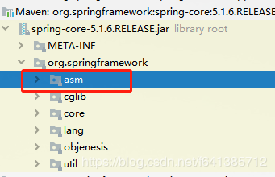

[TOC]
> ASM来获取普通类的函数参数，但如果不加`-parameters`或`-g`参数,ASM也无法获取到接口或者抽象类的函数参数。具体原因参见JVM与垃圾回收 --> CLASS字节码文章。


# 1. Spring MVC为何好使？
`SpringMVC`中获取的是普通类的函数参数。

`spring-core`中有个`ParameterNameDiscoverer`就是用来获取参数名的，底层用的是asm解析,但是接口方法的参数名无法得到,即只能是非接口类的方法参数名可以。

`Spring MVC`它最终依赖的是`DefaultParameterNameDiscoverer`去帮忙获取到入参名，看看这块代码：
```java
// @since 4.0
public class DefaultParameterNameDiscoverer extends PrioritizedParameterNameDiscoverer {

	public DefaultParameterNameDiscoverer() {
		if (!GraalDetector.inImageCode()) {
			if (KotlinDetector.isKotlinReflectPresent()) {
				addDiscoverer(new KotlinReflectionParameterNameDiscoverer());
			}
			addDiscoverer(new StandardReflectionParameterNameDiscoverer());
			addDiscoverer(new LocalVariableTableParameterNameDiscoverer());
		}
	}
}
```
`DefaultParameterNameDiscoverer`它就是一个责任链模式的体现，靠它添加进来的实现类来处理，也就是这哥俩：

* `StandardReflectionParameterNameDiscoverer`：依赖于-parameters才会有效（有java版本要求和编译参数要求）

* `LocalVariableTableParameterNameDiscoverer`：基于ASM实现，无版本和编译参数要求


备注：Spring使用ASM无需额外导包，因为自给自足了：



# 2. MyBatis为何不好使？
MyBatis是通过`接口`跟SQL语句绑定然后生成代理类来实现的。

> 说明：在Java8后使用`-parameter`参数即使是接口，是可以直接通过`Method`获取到入参名的，这个对MyBatis是好用的。当然为了保证兼容性，个人建议还是乖乖使用@Param注解来指定吧