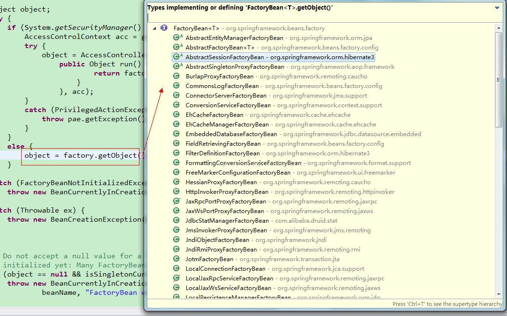

[TOC]

# 首先尝试从缓存中获取单例模式的 bean

```java
@SuppressWarnings("unchecked")
protected <T> T doGetBean(final String name, @Nullable final Class<T> requiredType,
        @Nullable final Object[] args, boolean typeCheckOnly) throws BeansException {
    final String beanName = transformedBeanName(name);//1. 获取 beanName，这里是一个转换动作，将beanName或aliasName或FactoryBean（带“&”前缀） 转换为 beanName
    Object bean;
    //2.缓存中获取单例bean，单例在Spring的同一个容器内只会被创建一次，后续再获取bean直接从单例缓存中获取
    //具体缓存在那里，参见循环依赖章节
    Object sharedInstance = getSingleton(beanName);//对于普通单例bean，这时已经拿到实例了？？
    if (sharedInstance != null && args == null) {
        if (logger.isDebugEnabled()) {
            if (isSingletonCurrentlyInCreation(beanName)) {//此处用于处理循环依赖
                logger.debug("Returning eagerly cached instance of singleton bean '" + beanName +
                        "' that is not fully initialized yet - a consequence of a circular reference");
            }
            else {
                logger.debug("Returning cached instance of singleton bean '" + beanName + "'");
            }
        }
        bean = getObjectForBeanInstance(sharedInstance, name, beanName, null);//3.对于普通的bean，直接返回 ，主要是处理FactoryBean
    }
    else {
        //如果没有获取到，则走创建bean的流程
    }
}
```


##  详解第3个注释---处理FactoryBean对象
**从bean的实例中获取对象:此时会处理FactoryBean对象，在方法后面对不同Scope的bean处理时，也调用了这个方法处理FactoryBean对象**
```java
bean = getObjectForBeanInstance(sharedInstance, name, beanName, null);
```
```java
protected Object getObjectForBeanInstance(
        Object beanInstance, String name, String beanName, @Nullable RootBeanDefinition mbd) {
    //第一步，如果是对FactoryBean的解引用
    if (BeanFactoryUtils.isFactoryDereference(name)) {
        //如果是NullBean则直接返回此bean
        if (beanInstance instanceof NullBean) {
            return beanInstance;
        }
        //如果不是FactoryBean类型，则验证不通过抛出异常
        if (!(beanInstance instanceof FactoryBean)) {
            throw new BeanIsNotAFactoryException(transformedBeanName(name), beanInstance.getClass());
        }
    }
    
    //第二步，如果上一步判断没成立，这一步表示如果是普通bean，直接返回
    //如果获取的beanInstance不是FactoryBean类型，则说明是普通的Bean，可直接返回
    //如果获取的beanInstance是FactoryBean类型,但是是以（以&开头的），也直接返回，此时返回的是FactoryBean的实例
    //另一种说法：如果Bean实例不是FactoryBean，或者指定名称是FactoryBean的解引用，也就是普通的bean调用，则直接返回当前的Bean实例
    if (!(beanInstance instanceof FactoryBean) || BeanFactoryUtils.isFactoryDereference(name)) {
        return beanInstance;
    }
    //处理对FactoryBean的调用
    Object object = null;
    if (mbd == null) {
        //从FactoryBean缓存中获取给定名称的实例对象
        object = getCachedObjectForFactoryBean(beanName);
    }
    if (object == null) {
        // Return bean instance from factory.
        FactoryBean<?> factory = (FactoryBean<?>) beanInstance;
        // Caches object obtained from FactoryBean if it is a singleton.
        //如果从FactoryBean生产的Bean是单态模式的，则缓存
        if (mbd == null && containsBeanDefinition(beanName)) {
            mbd = getMergedLocalBeanDefinition(beanName);
        }
        boolean synthetic = (mbd != null && mbd.isSynthetic());
        //到了这里说明获取的beanInstance是FactoryBean类型,但没有以"&"开头，此时就要返回factory内部getObject里面的对象了,调用FactoryBeanRegistrySupport类的getObjectFromFactoryBean方法，实现FactoryBean生产Bean对象实例的过程  		
        object = getObjectFromFactoryBean(factory, beanName, !synthetic);
    }
    return object;
}
```
>Dereference(解引用)：一个在C/C++中应用的比较多术语，在C++中，“\*”是解引用符号，“&”是引用符号。
解引用：变量所指向的是所引用对象的本身数据，而不是对象的内存地址。

上面的代码可以看到，对于大多数bean的getBean（普通bean），一般走到第二步就返回了，也就是说我们创建的Bean对象就是想要的bean，但对于FactoryBean的创建，如果是对内存地址的引用，那么取到的是它**生产的bean**，而不是它本身。

接着我们来看看真正的核心功能`getObjectFromFactoryBean(factory, beanName, !synthetic)`方法中实现的，此方法中为bean添加了后置处理器，尽可能保证所有bean初始化后都会调用注册的BeanPostProcessor的postProcessAfterInitialization方法进行处理，在实际开发过程中大可以针对此特性设计自己的业务处理。

继续跟进代码：
```java
	// FactoryBean生产Bean实例对象
	protected Object getObjectFromFactoryBean(FactoryBean factory,
			String beanName, boolean shouldPostProcess) {
		// BFactoryBean是单态模式，并且BFactoryBean缓存中存在指定名称的Bean实例对象
		if (factory.isSingleton() && containsSingleton(beanName)) {
			synchronized (getSingletonMutex()) {
				// 直接从FactoryBean缓存中获取指定名称的Bean实例对象
				Object object = this.factoryBeanObjectCache.get(beanName);
				// BFactoryBean缓存中没有指定名称的实例对象，则生产该实例对象
				if (object == null) {
					// 调用FactoryBean的getObject方法生产指定Bean的实例对象
					object = doGetObjectFromFactoryBean(factory, beanName,
							shouldPostProcess);
					// 将生产的实例对象添加到FactoryBean缓存中
					this.factoryBeanObjectCache.put(beanName,
							(object != null ? object : NULL_OBJECT));
				}
				return (object != NULL_OBJECT ? object : null);
			}
		}
		// 调用FactoryBean的getObject方法生产指定Bean的实例对象
		else {
			return doGetObjectFromFactoryBean(factory, beanName,
					shouldPostProcess);
		}
	}
```
这一个方法是区分单例和多例。
```java
	
	//调用FactoryBean的getObject方法生产指定Bean的实例对象  
    private Object doGetObjectFromFactoryBean(  
            final FactoryBean factory, final String beanName, final boolean shouldPostProcess)  
            throws BeanCreationException {  
        Object object;  
        try {  
            if (System.getSecurityManager() != null) {  
                AccessControlContext acc = getAccessControlContext();  
                try {  
                    //实现PrivilegedExceptionAction接口的匿名内置类  
                    //根据JVM检查权限，然后决定BeanFactory创建实例对象  
                    object = AccessController.doPrivileged(new PrivilegedExceptionAction<Object>() {  
                        public Object run() throws Exception {  
                                //调用BeanFactory接口实现类的创建对象方法  
                                return factory.getObject();  
                            }  
                        }, acc);  
                }  
                catch (PrivilegedActionException pae) {  
                    throw pae.getException();  
                }  
            }  
            else {  
            	//调用BeanFactory接口实现类的创建对象方法  
                object = factory.getObject();  
            }  
        }  
        catch (FactoryBeanNotInitializedException ex) {  
            throw new BeanCurrentlyInCreationException(beanName, ex.toString());  
        }  
        catch (Throwable ex) {  
            throw new BeanCreationException(beanName, "FactoryBean threw exception on object creation", ex);  
        }  
        //创建出来的实例对象为null，或者因为单态对象正在创建而返回null  
        if (object == null && isSingletonCurrentlyInCreation(beanName)) {  
            throw new BeanCurrentlyInCreationException(  
                    beanName, "FactoryBean which is currently in creation returned null from getObject");  
        }  
        //为创建出来的Bean实例对象添加BeanPostProcessor后置处理器  
        if (object != null && shouldPostProcess) {  
            try {  
                object = postProcessObjectFromFactoryBean(object, beanName);  
            }  
            catch (Throwable ex) {  
                throw new BeanCreationException(beanName, "Post-processing of the FactoryBean's object failed", ex);  
            }  
        }  
        return object;  
    } 
```

从代码中可以看到，具体产生Bean的地方是这个getObject方法，Spring为这个FactoryBean提供了70多个实现，比如Poxy、JDNI、RMI等等。




