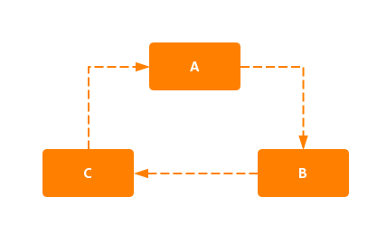

[TOC]
# 循环依赖处理
循环依赖并不仅仅只是在 doCreateBean() 中处理，其实在整个加载 bean 的过程中都有涉及，所以本篇内容并不仅仅只局限于 doCreateBean()。

## 一、什么是循环依赖
循环依赖其实就是循环引用，也就是两个或则两个以上的bean互相持有对方，最终形成闭环。比如A依赖于B，B依赖于C，C又依赖于A。如下图所示：



注意，这里不是函数的循环调用，是对象的相互依赖关系。循环调用其实就是一个死循环，除非有终结条件。
Spring中循环依赖场景有：

1. 构造器的循环依赖：该循环依赖，Spring 是无法解决的，只能抛出 BeanCurrentlyInCreationException 异常表示循环依赖

2. field属性的循环依赖： Spring 只解决 scope 为 singleton 的循环依赖，对于scope 为 prototype 的 bean Spring 无法解决，直接抛出 BeanCurrentlyInCreationException 异常。

## 二、如何检测循环依赖
检测循环依赖相对比较容易，Bean在创建的时候可以给该Bean打标，如果递归调用回来发现正在创建中的话，即说明了循环依赖了。

## 三、解决循环依赖

在 doGetBean() 中，首先会根据 beanName 从单例 bean 缓存中获取，如果不为空则直接返回。

```java
protected Object getSingleton(String beanName, boolean allowEarlyReference) {
    Object singletonObject = this.singletonObjects.get(beanName);
    if (singletonObject == null && isSingletonCurrentlyInCreation(beanName)) {
        synchronized (this.singletonObjects) {
            singletonObject = this.earlySingletonObjects.get(beanName);
            if (singletonObject == null && allowEarlyReference) {
                ObjectFactory<?> singletonFactory = this.singletonFactories.get(beanName);
                if (singletonFactory != null) {
                    singletonObject = singletonFactory.getObject();
                    this.earlySingletonObjects.put(beanName, singletonObject);
                    this.singletonFactories.remove(beanName);
                }
            }
        }
    }
    return singletonObject;
}
```
这个方法主要是从三个缓存中获取，分别是：singletonObjects、earlySingletonObjects、singletonFactories，三者定义如下：

```java
//单例对象的cache，第一级缓存
private final Map<String, Object> singletonObjects = new ConcurrentHashMap<>(256);

//提前暴光的单例对象的Cache，第二级缓存
private final Map<String, Object> earlySingletonObjects = new HashMap<>(16);

//单例对象工厂的cache,第三级缓存
private final Map<String, ObjectFactory<?>> singletonFactories = new HashMap<>(16);
```

* isSingletonCurrentlyInCreation() ：判断当前 singleton bean 是否处于创建中。bean 处于创建中也就是说 bean 在初始化但是没有完成初始化，有一个这样的过程其实和 Spring 解决 bean 循环依赖的理念相辅相成，因为 Spring 解决 singleton bean 的核心就在于**提前曝光 bean**。

* allowEarlyReference：从字面意思上面理解就是允许提前拿到引用。其实真正的意思是是否允许从 singletonFactories 缓存中通过 getObject() 拿到对象，为什么会有这样一个字段呢？原因就在于 singletonFactories 才是 Spring 解决 singleton bean 的诀窍所在，这个我们后续分析。

getSingleton() 整个过程如下：

1. 首先从一级缓存 singletonObjects 获取。

2. 如果没有且当前指定的 beanName 正在创建，就再从二级缓存中 earlySingletonObjects 获取。

3. 如果还是没有获取到则运行 singletonFactories 通过 getObject() 获取，则从三级缓存 singletonFactories 获取，
4. 如果获取到则，通过其 getObject() 获取对象，并将其加入到二级缓存 earlySingletonObjects 中 从三级缓存 singletonFactories 删除，如下：
```java
singletonObject = singletonFactory.getObject();
this.earlySingletonObjects.put(beanName, singletonObject);
this.singletonFactories.remove(beanName);
```

这样就从三级缓存升级到二级缓存了。

上面是从缓存中获取，但是**缓存中的数据从哪里添加进来的**呢？一直往下跟会发现在 doCreateBean() ( AbstractAutowireCapableBeanFactory ) 中，有这么一段代码：

```java
boolean earlySingletonExposure = (mbd.isSingleton() && this.allowCircularReferences && isSingletonCurrentlyInCreation(beanName));
if (earlySingletonExposure) {
    if (logger.isDebugEnabled()) {
        logger.debug("Eagerly caching bean '" + beanName +
                        "' to allow for resolving potential circular references");
    }
    addSingletonFactory(beanName, () -> getEarlyBeanReference(beanName, mbd, bean));
}
```
提前将创建好但还未进行属性赋值的的Bean放入缓存中。

如果 earlySingletonExposure == true 的话，则调用 addSingletonFactory() 将他们添加到缓存中，但是一个 bean 要具备如下条件才会添加至缓存中：

* 单例

* 运行提前暴露 bean

* 当前 bean 正在创建中

addSingletonFactory() 代码如下：
```java
protected void addSingletonFactory(String beanName, ObjectFactory<?> singletonFactory) {
    Assert.notNull(singletonFactory, "Singleton factory must not be null");
    synchronized (this.singletonObjects) {
        if (!this.singletonObjects.containsKey(beanName)) {
            this.singletonFactories.put(beanName, singletonFactory);
            this.earlySingletonObjects.remove(beanName);
            this.registeredSingletons.add(beanName);
        }
    }
}
```
从这段代码我们可以看出 singletonFactories 这个三级缓存才是解决 Spring Bean 循环依赖的诀窍所在。同时这段代码发生在 createBeanInstance() 方法之后，也就是说这个 bean 其实已经被创建出来了，但是它还不是很完美（没有进行属性填充和初始化），但是对于其他依赖它的对象而言已经足够了（可以根据对象引用定位到堆中对象），能够被认出来了，所以 Spring 在这个时候选择将该对象提前曝光出来让大家认识认识。

介绍到这里我们发现三级缓存 singletonFactories 和 二级缓存 earlySingletonObjects 中的值都有出处了，那一级缓存在哪里设置的呢？在类 DefaultSingletonBeanRegistry 中可以发现这个 addSingleton() 方法，源码如下：
```java
protected void addSingleton(String beanName, Object singletonObject) {
    synchronized (this.singletonObjects) {
        this.singletonObjects.put(beanName, singletonObject);
        this.singletonFactories.remove(beanName);
        this.earlySingletonObjects.remove(beanName);
        this.registeredSingletons.add(beanName);
    }
}
```
添加至一级缓存，同时从二级、三级缓存中删除。

这个方法在我们创建 bean 的链路中有哪个地方引用呢？其实在前面博客 LZ 已经提到过了，

在 doGetBean() 处理不同 scope 时，如果是 singleton，则调用 `getSingleton()`，

```java
if (mbd.isSingleton()) {
    sharedInstance = getSingleton(beanName, () -> {
        try {
            return createBean(beanName, mbd, args);
        }
        catch (BeansException ex) {
            // Explicitly remove instance from singleton cache: It might have been put there
            // eagerly by the creation process, to allow for circular reference resolution.
            // Also remove any beans that received a temporary reference to the bean.
            destroySingleton(beanName);
            throw ex;
        }
    });
    bean = getObjectForBeanInstance(sharedInstance, name, beanName, mbd);
}
```

```java
public Object getSingleton(String beanName, ObjectFactory<?> singletonFactory) {
    Assert.notNull(beanName, "Bean name must not be null");
    synchronized (this.singletonObjects) {
        Object singletonObject = this.singletonObjects.get(beanName);
        if (singletonObject == null) {
            //....
            try {
                singletonObject = singletonFactory.getObject();
                newSingleton = true;
            }
            //.....
            if (newSingleton) {
                addSingleton(beanName, singletonObject);
            }
        }
        return singletonObject;
    }
}
```

## 四、解决循环依赖的实例
**并没有解决循环依赖，只是保证互相之间依赖的时候，没有重复创建相同的实例。**

最后来描述下就上面那个循环依赖 Spring 解决的过程：

1. 首先 A 完成初始化第一步并将自己提前曝光出来（通过 ObjectFactory 将自己提前曝光），

2. 在初始化的时候，发现自己依赖对象 B，此时就会去尝试 get(B)，这个时候发现 B 还没有被创建出来，然后 B 就走创建流程，在 B 初始化的时候，同样发现自己依赖 C，C 也没有被创建出来。

3. 这个时候 C 又开始初始化进程，但是在初始化的过程中发现自己依赖 A，于是尝试 get(A)，这个时候由于 A 已经添加至缓存中（一般都是添加至三级缓存 singletonFactories ），通过 ObjectFactory 提前曝光，所以可以通过 ObjectFactory.getObject() 拿到 A 对象，

4. C 拿到 A 对象后顺利完成初始化，然后将自己添加到一级缓存中，回到 B ，

5. B 也可以拿到 C 对象，完成初始化，A 可以顺利拿到 B 完成初始化。
