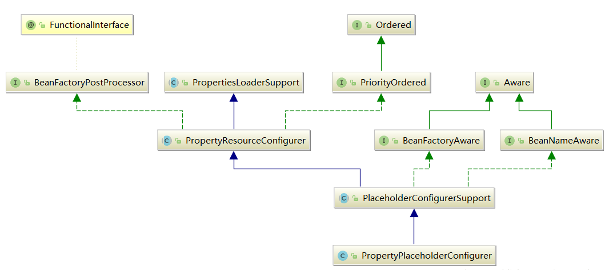

[TOC]

# 一、区别

* `BeanPostProcessor`：是spring容器加载bean的定义文件完，且**实例化了bean的定义的对象之后执行的**，在整个过程中，每实例化一个bean的对象，都会是调到BeanPostProcessor接口的方法。

* `BeanFactoryPostProcessor`是在spring容器加载了bean的定义文件之后，在**bean实例化之前执行的**。在整个过程中，只调用一次这个接口的实现类。

# 二、BeanPostProcessor-后置处理器

**都是在bean实例化之后执行的**

`BeanPostProcessor`：是spring容器加载bean的定义文件完，且实例化了bean的定义的对象之后执行的。BeanPostProcessor接口有两个方法，

* 一个是postProcessBeforeInitialization，在定义的init-method方法之前执行的

* 一个是postProcessAfterInitialzation。在定义的init-method方法之后执行的

在整个过程中，每实例化一个bean的对象，都会是调到BeanPostProcessor接口的方法。

```java
public interface BeanPostProcessor {
	//在定义的init-method方法之前执行的
	Object postProcessBeforeInitialization(Object bean, String beanName) throws BeansException;
	//在定义的init-method方法之后执行的
	Object postProcessAfterInitialization(Object bean, String beanName) throws BeansException;

}

```


### 典型应用：针对ApplicationContextAware
**前置处理器**：org.springframework.context.support.ApplicationContextAwareProcessor
```java
class  ApplicationContextAwareProcessor implements BeanPostProcessor {

    public Object postProcessBeforeInitialization(final Object bean, String beanName) throws BeansException {

            else {
                invokeAwareInterfaces(bean);
            }

            return bean;
        }

    private void invokeAwareInterfaces(Object bean) {
        if (bean instanceof Aware) {
            if (bean instanceof EnvironmentAware) {
                ((EnvironmentAware) bean).setEnvironment(this.applicationContext.getEnvironment());
            }
            if (bean instanceof EmbeddedValueResolverAware) {
                ((EmbeddedValueResolverAware) bean).setEmbeddedValueResolver(this.embeddedValueResolver);
            }
            if (bean instanceof ResourceLoaderAware) {
                ((ResourceLoaderAware) bean).setResourceLoader(this.applicationContext);
            }
            if (bean instanceof ApplicationEventPublisherAware) {
                ((ApplicationEventPublisherAware) bean).setApplicationEventPublisher(this.applicationContext);
            }
            if (bean instanceof MessageSourceAware) {
                ((MessageSourceAware) bean).setMessageSource(this.applicationContext);
            }
            if (bean instanceof ApplicationContextAware) {
                ((ApplicationContextAware) bean).setApplicationContext(this.applicationContext);
            }
        }
    }
}
```

# 三、BeanFactoryPostProcessor的典型应用：PropertyPlaceholderConfigurer

有时候我们在阅读spring的配置文件中的Bean的描述时，会遇到类似如下情况：
```xml
<bean id="user" class="com.yhl.myspring.demo.applicationcontext.User">
    <property name="name" value="${user.name}"/>
    <property name="birthday" value="${user.birthday"/>
</bean>
```

这其中出现了变量：user.name、user.name、{user.birthday}，这是spring的分散配置，可以在另外的配置文件中为user.name、user.birthday指定值，例如在bean.properties文件中定义：
```shell
user.name = xiaoming
user.birthday = 2019-04-19
```
当访问名为user的bean时，其name属性就会被字符串xiaoming替换，那spring框架是怎么知道存在这样的配置文件呢，这个就是PropertyPlaceholderConfigurer，需要在配置文件中添加一下代码：

```xml
<bean id="userHandler" class="org.springframework.beans.factory.config.PropertyPlaceholderConfigurer">
    <property name="locations">
        <list>
            <value>classpath:bean.properties</value>
        </list>
    </property>
</bean>
```
## 配置注意事项
Spring容器仅允许最多定义一个 `PropertyPlaceholderConfigurer` 或 `<content:property-placeholder>`其余的会被Spring忽略。

因为Spring容器采用反射扫描的发现机制，在探测到Spring容器中有一个 org.springframework.beans.config.PropertyPlaceholderConfigurer的Bean就会停止对剩余PropertyPlaceholderConfigurer的扫描，


由于Spring容器只能有一个PropertyPlaceholderConfigurer，如果有多个属性文件，这时就看谁先谁后了，先的保留 ，后的忽略。

### Spring 自动注入 properties文件中的参数值

要自动注入properties文件中的配置，需要在Spring配置文件中添加  
`org.springframework.beans.factory.config.PropertiesFactoryBean` 和`org.springframework.beans.factory.config.PreferencesPlaceholderConfigurer`的实例配置
```xml
<bean id="configProperties" class="org.springframework.beans.factory.config.PropertiesFactoryBean">
    <property name="locations">
        <list>
            <value> classpath*:application.properties</value>
        </list>
    </property>
</bean>
<bean id="propertyConfigurer" class="org.springframework.beans.factory.config.PreferencesPlaceholderConfigurer">
    <property name="properties" ref="configProperties" />
</bean>
```
在这个配置文件中我们配置了注解扫描，和configProperties实例和propertyConfigurer实例，这样我们就可以在java类中自动注入配置了

```java
@Component
public class Test{
    @Value("#{configProperties['userName']}")
    private String userName;

    public String getUserName(){
        return userName;
    }
}
```

自动注入需要使用 `@Value` 这个注解，这个注解的格式 `#{configProperties['userName']}` 其中configProperties是我们在配置文件中配置的bean的 id， userName 是在配置文件中配置的项


## 原因
在上一节bean中指定了配置文件的位置。这个userHandler只不过是spring框架管理的一个bean，并没有被别的bean或者对象引用，spring的beanFactory是怎么知道这个需要从这个bean中获取配置信息呢？

我们看下PropertyPlaceholderConfigurer这个类的层次结构，如下图： 




从上图中我们可以看到PropertyPlaceholderConfigurer间接的继承了BeanFactoryPostProcessor接口，

当spring加载任何实现了这个接口的bean的配置时，都会在bean工厂载入所有bean的配置之后执行postProcessBeanFactory方法。

在PropertyResourceConfigurer类中实现了postProcessBeanFactory方法，在方法中先后调用了mergeProperties、convertProperties、processProperties这三个方法，分别得到配置，将得到的配置转换为合适的类型，最后将配置内容告知BeanFactory。

正是通过实现BeanFactoryPostProcessor接口，BeanFactory会在实例化任何bean之前获得配置信息，从而能够正确的解析bean描述文件中的变量引用。

```java
public void postProcessBeanFactory(ConfigurableListableBeanFactory beanFactory) throws BeansException {
    try {
        Properties mergedProps = this.mergeProperties();
        this.convertProperties(mergedProps);
        this.processProperties(beanFactory, mergedProps);
    } catch (IOException var3) {
        throw new BeanInitializationException("Could not load properties", var3);
    }
}
```