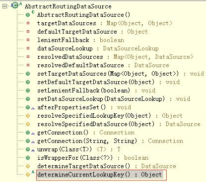

[TOC]
下面就讲讲在Spring中如何进行数据源切换。这里是使用AbstractRoutingDataSource类来完成具体的操作，AbstractRoutingDataSource是Spring2.0后增加的。




实现数据源切换的功能就是自定义一个类扩展AbstractRoutingDataSource抽象类，其实该相当于数据源DataSourcer的路由中介，可以实现在项目运行时根据相应key值切换到对应的数据源DataSource上。先看看AbstractRoutingDataSource的源码：

```java
public abstract class AbstractRoutingDataSource extends AbstractDataSource implements InitializingBean {
    /* 只列出部分代码 */
    private Map<Object, Object> targetDataSources;

    private Object defaultTargetDataSource;

    private boolean lenientFallback = true;

    private DataSourceLookup dataSourceLookup = new JndiDataSourceLookup();

    private Map<Object, DataSource> resolvedDataSources;

    private DataSource resolvedDefaultDataSource;

    @Override
    public Connection getConnection() throws SQLException {
        return determineTargetDataSource().getConnection();
    }

    @Override
    public Connection getConnection(String username, String password) throws SQLException {
        return determineTargetDataSource().getConnection(username, password);
    }

    protected DataSource determineTargetDataSource() {
        Assert.notNull(this.resolvedDataSources, "DataSource router not initialized");
        Object lookupKey = determineCurrentLookupKey();
        DataSource dataSource = this.resolvedDataSources.get(lookupKey);
        if (dataSource == null && (this.lenientFallback || lookupKey == null)) {
            dataSource = this.resolvedDefaultDataSource;
        }
        if (dataSource == null) {
            throw new IllegalStateException("Cannot determine target DataSource for lookup key [" + lookupKey + "]");
        }
        return dataSource;
    }

    protected abstract Object determineCurrentLookupKey();
}
```

从源码可以看出AbstractRoutingDataSource继承了AbstractDataSource并实现了InitializingBean，AbstractRoutingDataSource的getConnection()方法调用了determineTargetDataSource()的该方法，这里重点看determineTargetDataSource()方法代码，方法里使用到了determineCurrentLookupKey()方法，它是AbstractRoutingDataSource类的抽象方法，也是实现数据源切换要扩展的方法，该方法的返回值就是项目中所要用的DataSource的key值，拿到该key后就可以在resolvedDataSource中取出对应的DataSource，如果key找不到对应的DataSource就使用默认的数据源。


自定义类扩展AbstractRoutingDataSource类时就是要重写determineCurrentLookupKey()方法来实现数据源切换功能。下面是自定义的扩展AbstractRoutingDataSource类的实现：

```java
/**
 * 获得数据源
 */
public class MultipleDataSource extends AbstractRoutingDataSource{

    @Override
    protected Object determineCurrentLookupKey() {
         return DynamicDataSourceHolder.getRouteKey();
    }
}
```

DynamicDataSourceHolder类如下，实现对数据源的操作功能：
```java
/**
 * 数据源操作类
 */
public class DynamicDataSourceHolder {
    private static ThreadLocal<String> routeKey = new ThreadLocal<String>();

    /**
     * 获取当前线程的数据源路由的key
     */
    public static String getRouteKey()
    {
        String key = routeKey.get();
        return key;
    }

    /**
     * 绑定当前线程数据源路由的key
     * 使用完成后必须调用removeRouteKey()方法删除
     */
    public static void  setRouteKey(String key)
    {
        routeKey.set(key);
    }

    /**
     * 删除与当前线程绑定的数据源路由的key
     */
    public static void removeRouteKey()
    {
        routeKey.remove();
    }
}
```

下面在xml文件中配置多个数据源：
```xml
<!-- 数据源 -->

<bean id="parentDataSource" abstract="true" class="com.alibaba.druid.pool.DruidDataSource" init-method="init"  destroy-method="close">

        <property name="driverClassName" value="${dc.jdbc.driver.bi}"/>
        <!-- 配置初始化大小、最小、最大 -->
        <property name="initialSize" value="${dc.jdbc.initialPoolSize}"/>
        <property name="minIdle" value="${dc.jdbc.minPoolSize}"/>
        <property name="maxActive" value="${dc.jdbc.maxPoolSize}"/>

        <!-- 配置获取连接等待超时的时间 -->
        <property name="maxWait" value="1800"/>

        <!-- 配置间隔多久才进行一次检测，检测需要关闭的空闲连接，单位是毫秒 -->
        <property name="timeBetweenEvictionRunsMillis" value="60000"/>

        <!-- 配置一个连接在池中最小生存的时间，单位是毫秒 -->
        <property name="minEvictableIdleTimeMillis" value="300000"/>
        <!-- mysql SELECT 'x'  Oracle: SELECT 1 FROM DUAL -->
        <property name="validationQuery" value="SELECT 'x'"/>
        <property name="testWhileIdle" value="true"/>
        <property name="testOnBorrow" value="false"/>
        <property name="testOnReturn" value="false"/>

        <!-- 打开PSCache，并且指定每个连接上PSCache的大小 -->
        <!-- 如果用Oracle，则把poolPreparedStatements配置为true，mysql可以配置为false。分库分表较多的数据库，建议配置为false。 -->
        <property name="poolPreparedStatements" value="false"/>
        <property name="maxPoolPreparedStatementPerConnectionSize" value="20"/>
        <!-- 配置监控统计拦截的filters，去掉后监控界面sql无法统计 wall=防火墙 -->
        <property name="filters" value="stat"/>
        <property name="connectionProperties"
                  value="druid.stat.slowSqlMillis=10000;config.decrypt=false"/><!-- 慢SQL标准 -->
        <property name="removeAbandoned" value="true"/> <!-- 打开removeAbandoned功能 -->
        <property name="removeAbandonedTimeout" value="1800"/> <!-- 1800秒，也就是30分钟 -->
        <property name="logAbandoned" value="true"/> <!-- 关闭abanded连接时输出错误日志 -->
    </bean>
    
    
<bean id="dataSource1" parent="parentDataSource">
      <property name="url" value="jdbc:jtds:sqlserver://127.0.0.1;databaseName=test">
     </property>
     <property name="username" value="***"></property>
     <property name="password" value="***"></property>
 </bean>
 <bean id="dataSource2" parent="parentDataSource">
      <property name="url" value="jdbc:jtds:sqlserver://127.0.0.2:1433;databaseName=test">
     </property>
     <property name="username" value="***"></property>
     <property name="password" value="***"></property>
</bean>

<!-- 配置多数据源映射 -->
<bean id="multipleDataSource" class="MultipleDataSource" >
     <property name="targetDataSources">
         <map key-type="java.lang.String">
             <entry value-ref="dataSource1" key="dataSource1"></entry>
             <entry value-ref="dataSource2" key="dataSource2"></entry>
         </map>
     </property>
     <!-- 默认数据源 -->
     <property name="defaultTargetDataSource" ref="dataSource1" >
     </property>
</bean>
```
> 集成druid数据源，使用parent属性来减少配置。parentDataSource是父bean，其中abstract="true"表示parentDataSource不会被创建，类似于于抽象类。其中dataSource1、dataSource2继承了
parentDataSource， 允许子bean对父属性进行修改，修改后的属性会覆盖parentDataSource。

> 如果子bean定义没有指定class属性，它将使用父bean定义的class属性，当然也可以覆盖它。在后面一种情况中，子bean的class属性值必须同父bean兼容，也就是说它必须接受父bean的属性值。
一个子bean定义可以从父bean继承构造器参数值、属性值以及覆盖父bean的方法，并且可以有选择地增加新的值。如果指定了init-method，destroy-method和/或静态factory-method，它们就会覆盖父bean相应的设置。


到这里基本的配置就完成了，以下分为两种方式：

##### 1. 需要切换数据源时手动加上切换数据源的代码
一般是在dao层操作数据库前进行切换的，只需在数据库操作前加上如下代码即可：

```java
DynamicDataSourceHolder.setRouteKey("dataSource2");
```

##### 2. AOP方式，需要切换数据源时在类或方法上写上自定义注解标签
```java
@DataSourceKey("dataSource1")
public interface TestEntityMapper extends MSSQLMapper<TestEntity> {
    public void insertTest(TestEntity testEntity);
}
```

DataSourceKey注解代码如下：
```java
@Target({ElementType.TYPE,ElementType.METHOD})
@Retention(RetentionPolicy.RUNTIME)
@Documented
public @interface DataSourceKey {
    String value() default "";
}
```

注解配置完后就要写一个实现数据源切换的类，如下：
```java

public class MultipleDataSourceExchange {

    /** 
     * 拦截目标方法，获取由@DataSource指定的数据源标识，设置到线程存储中以便切换数据源 
     */  
    public void beforeDaoMethod(JoinPoint point) throws Exception {  
        Class<?> target = point.getTarget().getClass();  
        MethodSignature signature = (MethodSignature) point.getSignature();  
        // 默认使用目标类型的注解，如果没有则使用其实现接口的注解类  
        for (Class<?> cls : target.getInterfaces()) {  
            resetDataSource(cls, signature.getMethod());  
        }  
        resetDataSource(target, signature.getMethod());  
    }  


    /** 
     * 提取目标对象方法注解和类注解中的数据源标识 
     */  
    private void resetDataSource(Class<?> cls, Method method) {  
        try {  
            Class<?>[] types = method.getParameterTypes();  
            // 默认使用类注解  
            if (cls.isAnnotationPresent(DataSourceKey.class)) {  
                DataSourceKey source = cls.getAnnotation(DataSourceKey.class);  
                DynamicDataSourceHolder.setRouteKey(source.value());  
            }  
            // 方法注解可以覆盖类注解  
            Method m = cls.getMethod(method.getName(), types);  
            if (m != null && m.isAnnotationPresent(DataSourceKey.class)) {  
                DataSourceKey source = m.getAnnotation(DataSourceKey.class);   
                DynamicDataSourceHolder.setRouteKey(source.value());  
            }  
        } catch (Exception e) {  
            System.out.println(cls + ":" + e.getMessage());  
        }  
    }  
}
```

代码写完后就要在xml配置文件上添加配置了（只列出部分配置）：
```xml

<bean id="multipleDataSourceExchange" class="MultipleDataSourceExchange "/>

<bean id="txManager" class="org.springframework.jdbc.datasource.DataSourceTransactionManager">
    <property name="dataSource" ref="multipleDataSource" />
  </bean>

<tx:advice id="txAdvice" transaction-manager="txManager">
    <tx:attributes>
       <tx:method name="insert*" propagation="NESTED" rollback-for="Exception"/>
       <tx:method name="add*" propagation="NESTED" rollback-for="Exception"/>
       ...
    </tx:attributes>
  </tx:advice>

<aop:config>
    <aop:pointcut id="service" expression="execution(* com.datasource..*.service.*.*(..))"/>
    <!-- 注意切换数据源操作要比持久层代码先执行 -->
    <aop:advisor advice-ref="multipleDataSourceExchange" pointcut-ref="service" order="1"/>
    <aop:advisor advice-ref="txAdvice" pointcut-ref="service" order="2"/>
 </aop:config>
```