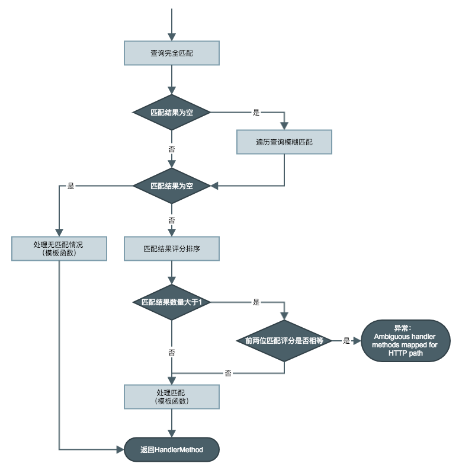

# 一. 问题
在ModelService中，我们使用SpringMVC框架来实现RESTful接口。但是，在最近一次对ModelService的更新中我们发现SpringMVC的RESTful接口性能存在问题。
1. RESTful：
```java
@RequestMapping(path = "/list/cityId/{cityId}", method = RequestMethod.GET)
@ResponseBody
public String getJsonByCityId(@PathVariable Integer cityId)
```
客户端请求： GET /list/cityId/1
2. 非RESTful：
```java
@RequestMapping(path = "/list/cityId", method = RequestMethod.GET)
@ResponseBody
public String getJsonByCityId(@RequestParam Integer cityId)
```
客户端请求： GET /list/cityId?cityId=1

经过测试，非RESTful接口的性能是RESTful接口的两倍，且请求的最大响应时间是35毫秒，有99%的请求在20毫秒内完成。相比之下，RESTful接口的最大响应时间是436毫秒。

# 二. 原因
为了保证RESTful风格，继续使用`@PathVariable`,采用方案针对SpringMVC进行改造。
SpringMVC的请求处理过程中的路径匹配过程：


`org.springframework.web.servlet.handler.AbstractHandlerMethodMapping#lookupHandlerMethod
(spring-webmvc-4.2.3.RELEASE) `
路径匹配的过程中有如下代码：
```java
List<Match> matches = new ArrayList<Match>();
List<T> directPathMatches = this.mappingRegistry.getMappingsByUrl(lookupPath);
if (directPathMatches != null) {
   addMatchingMappings(directPathMatches, matches, request);
}
if (matches.isEmpty()) {
   // No choice but to go through all mappings...
   addMatchingMappings(this.mappingRegistry.getMappings().keySet(), matches, request);
}
```
SpringMVC首先对HTTP请求中的path与已注册的RequestMappingInfo（经解析的@RequestMapping）中的path进行一个完全匹配来查找对应的HandlerMethod，即处理该请求的方法，这个匹配就是一个Map#get方法。若找不到则会遍历所有的RequestMappingInfo进行查找。这个查找是不会提前停止的，直到遍历完全部的RequestMappingInfo。

看一下AbstractHandlerMethodMapping 抽象类的实现类RequestMappingHandlerMapping中经过一系列调用后，最终的实现遍历的方法`org.springframework.web.servlet.mvc.method.RequestMappingInfo#getMatchingCondition
`
```java
public RequestMappingInfo getMatchingCondition(HttpServletRequest request) {
    RequestMethodsRequestCondition methods = this.methodsCondition.getMatchingCondition(request);
    ParamsRequestCondition params = this.paramsCondition.getMatchingCondition(request);
    HeadersRequestCondition headers = this.headersCondition.getMatchingCondition(request);
    ConsumesRequestCondition consumes = this.consumesCondition.getMatchingCondition(request);
    ProducesRequestCondition produces = this.producesCondition.getMatchingCondition(request);

    if (methods == null || params == null || headers == null || consumes == null || produces == null) {
        if (CorsUtils.isPreFlightRequest(request)) {
            methods = getAccessControlRequestMethodCondition(request);
            if (methods == null || params == null) {
                return null;
            }
        }
        else {
            return null;
        }
    }

    PatternsRequestCondition patterns = this.patternsCondition.getMatchingCondition(request);
    if (patterns == null) {
        return null;
    }

    RequestConditionHolder custom = this.customConditionHolder.getMatchingCondition(request);
    if (custom == null) {
        return null;
    }

    return new RequestMappingInfo(this.name, patterns,
            methods, params, headers, consumes, produces, custom.getCondition());
}
```
在遍历过程中，SpringMVC首先会根据`@RequestMapping`中的`headers, params, produces, consumes, methods`与实际的`HttpServletRequest`中的信息对比，剔除掉一些明显不合格的RequestMapping。

如果以上信息都能够匹配上，那么SpringMVC会对RequestMapping中的path进行正则匹配，剔除不合格的。

```java
Comparator<Match> comparator = new MatchComparator(getMappingComparator(request));
Collections.sort(matches, comparator);
```
接下来会对所有留下来的候选@RequestMapping进行评分并排序。最后选择分数最高的那个作为结果。
评分的优先级为：
```shell
path pattern > params > headers > consumes > produces > methods
```
所以使用非RESTful风格的URL时，SpringMVC可以立刻找到对应的HandlerMethod来处理请求。但是当在URL中存在变量时，即使用了`@PathVariable`时，SpringMVC就会进行上述的复杂流程。

值得注意的是SpringMVC在匹配`@RequestMapping`中的path时是通过`AntPathMatcher`进行的，这段path匹配逻辑是从Ant中借鉴过来的。
> Part of this mapping code has been kindly borrowed from Apache Ant.

```java
//org.springframework.util.AntPathMatcher
String[] pattDirs = tokenizePattern(pattern);
String[] pathDirs = tokenizePath(path);

int pattIdxStart = 0;
int pattIdxEnd = pattDirs.length - 1;
int pathIdxStart = 0;
int pathIdxEnd = pathDirs.length - 1;

// Match all elements up to the first **
while (pattIdxStart <= pattIdxEnd && pathIdxStart <= pathIdxEnd) {
    String pattDir = pattDirs[pattIdxStart];
    if ("**".equals(pattDir)) {
        break;
    }
    if (!matchStrings(pattDir, pathDirs[pathIdxStart], uriTemplateVariables)) {
        return false;
    }
    pattIdxStart++;
    pathIdxStart++;
}
```
path的匹配首先会把url按照“／”分割，然后对于每一部分都会使用到正则表达式，即使该字符串是定长的静态的。所以该匹配逻辑的性能可能会很差。

在大多数情况下，我们在写@RequestMapping时不会去写除了path以外的值，至多会指定一个produces，这会让SpringMVC难以快速剔除不合格的候选者。我们首先试图让SpringMVC在进行path匹配前就可以产生匹配结果，从而不去执行path匹配的逻辑，以提高效率。然而实际情况是我们无法做到让每个方法都有独特的params, produces, consumes, methods，所以我们尝试让每个方法有一个独特的headers，然后进行了一次性能测试。性能的确得到了一定的提升（约20%），但这个结果并不令我们满意，我们需要的是能够达到与非RESTful接口一样的性能。

通过继承

`org.springframework.web.servlet.mvc.method.annotation.RequestMappingHandlerMapping`

我们可以实现自己的匹配逻辑。由于ModelService已经服务化，所以每个接口都有一个服务名，通过这个服务名即可直接找到对应的方法，并不需要通过@RequestMapping匹配的方式。而在服务消费端，由于服务消费端是通过服务名进行的方法调用，所以在服务消费端可以很直接地获取到服务名，把服务名加到HTTP请求的header中并不需要对代码进行大量的修改。

# 三. 解决方案
## 服务端：
1. 在每个`@RequestMapping`中添加接口对应服务名的信息。

2. 实现自己定义的HandlerMethod查询逻辑，在HandlerMethod注册时记录与之对应的服务名，在查询时通过HTTP请求头中的服务名查表获得HandlerMethod。

## 客户端：
1. 调用服务时将服务名加入到HTTP请求头中
## 分析：
* 这样的查询时间复杂度是O(1)的，典型的空间换时间。理论上使用这样的查找逻辑的效率和非RESTful接口的效率是一样的。

* 由于HandlerMethod的注册是在服务启动阶段完成的，且在运行时不会发生改变，所以不用考虑注册的效率以及并发问题。

* SpringMVC提供了一系列的方法可以让我们替换它的组件，所以该方案的可行性很高。

## 实现细节
1. 我们要建立一个HandlerMethod与服务名的映射，保存在一个Map中。注意到在`@RequestMapping`中有一个name属性，这个属性并没有被SpringMVC用在匹配逻辑中。该属性是用来在JSP中直接生成接口对应的URL的，所以在`AbstractHandlerMethodMapping.MappingRegistry`中已经提供了一个name与Handler Method的映射，直接拿来用即可。
```java
/**
 * Return handler methods by mapping name. Thread-safe for concurrent use.
 */
public List<HandlerMethod> getHandlerMethodsByMappingName(String mappingName) {
    return this.nameLookup.get(mappingName);
}
```

2. 所以我们只需要在每个接口的@RequestMapping中添加name属性，值为接口的服务名。在SpringMVC启动时会自动帮我们建立起一个服务名与Handler Method的映射。我们只要在匹配时从HTTP请求头中获取请求的服务名，然后从该Map中查询到对应的HandlerMethod返回。如果没有查询到则调用父类中的原匹配逻辑，这样可以保证不会对现有的系统造成问题。

### 使用Java类＋注解的方式
1. 继承WebMvcConfigurationSupport类，复写createRequestMappingHandlerMapping方法返回自定义的RequestMappingHandlerMapping类。
```java
 @Override
    protected RequestMappingHandlerMapping createRequestMappingHandlerMapping() {
        return new RestfulRequestMappingHandlerMapping();
    }
```
在WebMvcConfigurationSupport类中，该`requestMappingHandlerMapping()`方法上有`@Bean`注解，意思是：让Sring容器管理这个方法，在该方法中调用了`createRequestMappingHandlerMapping()`方法来实例化RequestMappingHandlerMapping，所以需要重写`createRequestMappingHandlerMapping()`方法来实例化我们自己的`RestfulRequestMappingHandlerMapping()`方法。

有`@Bean`注解的方法`requestMappingHandlerMapping()`肯定在Spring初始化进行了调用，所以才能制定使用RequestMappingHandlerMapping这个实现类来解析和处理URL。
```java
/**
 * Return a {@link RequestMappingHandlerMapping} ordered at 0 for mapping
 * requests to annotated controllers.
 */
@Bean
public RequestMappingHandlerMapping requestMappingHandlerMapping(
        @Qualifier("mvcContentNegotiationManager") ContentNegotiationManager contentNegotiationManager,
        @Qualifier("mvcConversionService") FormattingConversionService conversionService,
        @Qualifier("mvcResourceUrlProvider") ResourceUrlProvider resourceUrlProvider) {

    RequestMappingHandlerMapping mapping = createRequestMappingHandlerMapping();
    mapping.setOrder(0);
    /*中间省略*/
    return mapping;
   }
```
其中`createRequestMappingHandlerMapping()`方法：
```java
/**
 * Protected method for plugging in a custom subclass of
 * {@link RequestMappingHandlerMapping}.
 * @since 4.0
 */
protected RequestMappingHandlerMapping createRequestMappingHandlerMapping() {
    return new RequestMappingHandlerMapping();
}
```

2. 继承RequestMappingHandlerMapping类，重写lookupHandlerMethod方法，完成自己的查找逻辑。
```java
@Override
    protected HandlerMethod lookupHandlerMethod(String lookupPath, HttpServletRequest request) throws Exception {
    //自己的查找逻辑，如果找不到，再执行原有的逻辑，以免出现错误情况
        HandlerMethod handlerMethod = lookupHandlerMethodHere(lookupPath, request);
        if (handlerMethod == null)
            handlerMethod = super.lookupHandlerMethod(lookupPath, request);
        return handlerMethod;
    }

//自己的查找逻辑，根据从请求头中获取服务名servicename，进行匹配查找
private HandlerMethod lookupHandlerMethodHere(String lookupPath, HttpServletRequest request) {
        String servicename = request.getHeader("servicename");
        if (!StringUtils.isEmpty(servicename)) {
            List<HandlerMethod> methodList = this.getHandlerMethodsForMappingName(servicename);
            if (methodList.size() > 0){
                HandlerMethod handlerMethod = methodList.get(0);    
                RequestMappingInfo requestMappingInfo = mappingLookup.get(handlerMethod);
                //在源码中用于将路径添加到Request的属性表中，以便后面@PathVarible参数的处理 
                //在Spring5.2.3以及以后版本中该方法更改了requestMappingInfo参数为bestMatch.mapping，所以需要重写处理传入参数
                handleMatch(requestMappingInfo, lookupPath, request);
                return handlerMethod;
            }
        }
        return null;
    }
```

其中：
```java
/**
 * Return the handler methods for the given mapping name.
 * @param mappingName the mapping name
 * @return a list of matching HandlerMethod's or {@code null}; the returned
 * list will never be modified and is safe to iterate.
 * @see #setHandlerMethodMappingNamingStrategy
 */
@Nullable
public List<HandlerMethod> getHandlerMethodsForMappingName(String mappingName) {
    return this.mappingRegistry.getHandlerMethodsByMappingName(mappingName);
}
```
