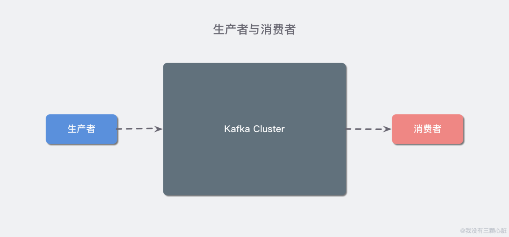
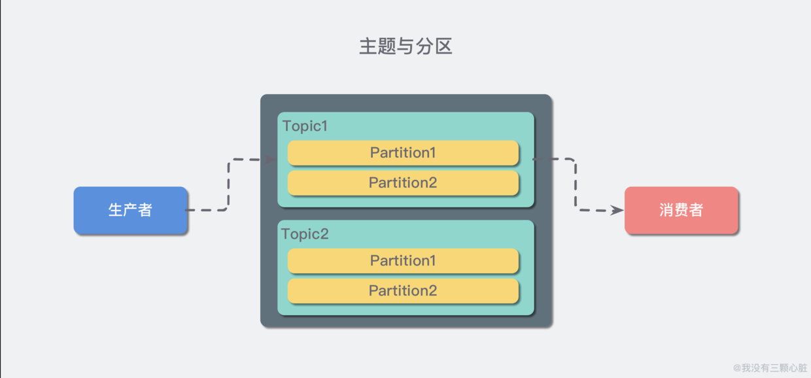
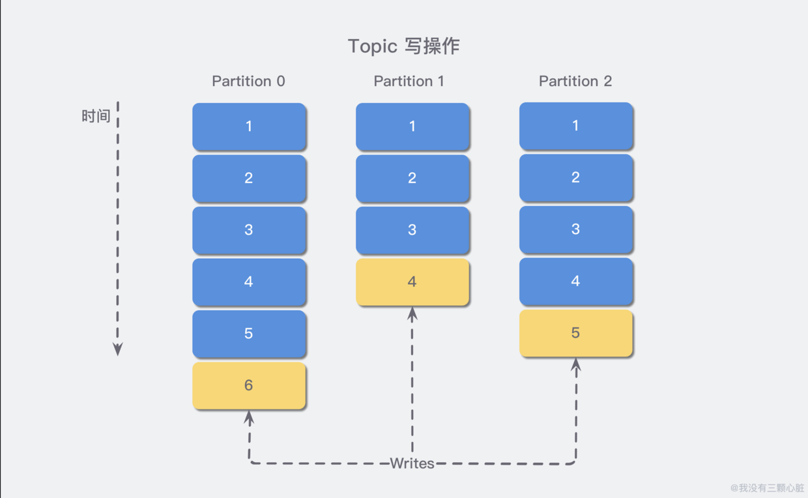
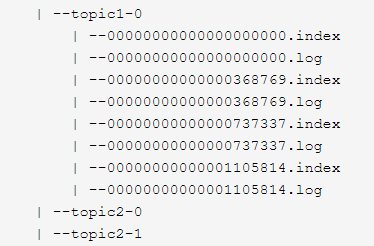
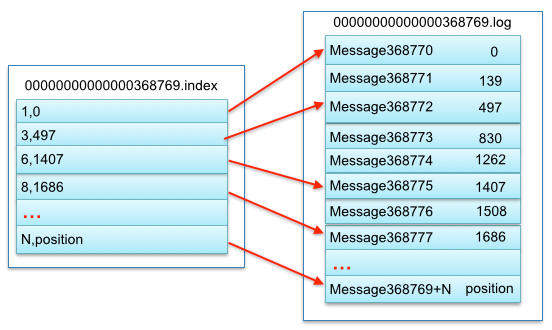

[TOC]
# Kafka 简介

Kafka 是一种分布式的，基于发布 / 订阅的消息系统。主要设计目标如下：

* 以时间复杂度为 O(1) 的方式提供消息持久化能力，即使对 TB 级以上数据也能保证常数时间复杂度的访问性能。

* 高吞吐率。即使在非常廉价的商用机器上也能做到单机支持每秒 100K 条以上消息的传输。

* 支持 Kafka Server 间的消息分区，及分布式消费，同时保证每个 Partition 内的消息顺序传输。

* 同时支持离线数据处理和实时数据处理。

* Scale out：支持在线水平扩展。


# Kafka 基础概念
## 概念一：生产者与消费者


对于 Kafka 来说客户端有两种基本类型：生产者（Producer）和消费者（Consumer）。

* 生产者（也称为发布者）创建消息，
* 消费者（也称为订阅者）负责消费or读取消息。


除此之外，还有用来做数据集成的 Kafka Connect API 和流式处理的 Kafka Streams 等高阶客户端，但这些高阶客户端底层仍然是生产者和消费者API，它们只不过是在上层做了封装。

## 概念二：消费者与消费组
消息模型可以分为两种， 
*  队列的处理方式是 一组消费者从服务器读取消息，一条消息只有其中的一个消费者来处理。

* 发布-订阅模型中，消息被广播给所有的消费者，接收到消息的消费者都可以处理此消息。

Kafka为这两种模型提供了单一的消费者抽象模型： **消费者组** （consumer group）。 消费者用一个消费者组名标记自己。 一个发布在topic的分区中的消息，只能发送给消费者组中的一个消费者

* 假如所有的消费者都在一个组中，那么这就变成了queue（队列）模型。允许同名的消费者组成员瓜分处理

* 假如所有的消费者都在不同的组中，那么就完全变成了发布-订阅模型。允许你广播消息给多个消费者组（不同名）。

更通用的， 我们可以创建一些消费者组作为逻辑上的订阅者。每个组包含数目不等的消费者， 一个组内多个消费者可以用来扩展性能和容错。正如下图所示：

2个kafka集群托管4个分区（P0-P3），2个消费者组，消费组A有2个消费者实例，消费组B有4个。

### 如何保证消息的处理顺序

##### 1. 传统的队列模型

队列模型保持消息，并且保证它们的先后顺序不变。但是， 尽管服务器保证了消息的顺序，消息还是异步的发送给各个消费者，消费者收到消息的先后顺序不能保证了。这也意味着并行消费将不能保证消息的先后顺序。

所以消息系统常常通过仅设1个消费者来解决这个问题，但是这意味着没用到并行处理。

##### 2. Kafka

Kafka采用了一种分而治之的策略：分区。 

因为Topic**分区**中消息只能由消费者组中的**唯一一个**消费者处理，所以消息肯定是按照先后顺序进行处理的。

但是它也仅仅是保证Topic的一个分区顺序处理，不能保证跨分区的消息先后处理顺序。 

所以，如果你想要顺序的处理Topic的所有消息，那就只提供一个分区。

通过并行topic的parition —— kafka提供了顺序保证和负载均衡。**每个partition仅由同一个消费者组中的一个消费者消费到。并确保消费者是该partition的唯一消费者，并按顺序消费数据。** 每个topic有多个分区，则需要对**多个消费者做负载均衡**，但请注意，**相同的消费者组中不能有比分区更多的消费者，否则多出的消费者一直处于空等待，不会收到消息。**

kafka有比传统的消息系统更强的顺序保证。

## 概念二：主题（Topic）与分区（Partition）


在 Kafka 中，消息以主题（Topic）来分类，每一个主题都对应一个「消息队列」。

分区（Partition）的概念，类似“允许多修几条道”的方式对主题实现水平扩展。


上述的 Topic 其实是逻辑上的概念，面向消费者和生产者，物理上存储的其实是 Partition，每一个 Partition 最终对应一个目录，里面存储所有的消息和索引文件。

默认情况下，每一个 Topic 在创建时如果不指定 Partition 数量时只会创建 1 个 Partition。比如，我创建了一个 Topic 名字为 test ，没有指定 Partition 的数量，那么会默认创建一个 test-0 的文件夹，这里的命名规则是：`<topic_name>-<partition_id>`。



任何发布到 Partition 的消息都会被追加到 Partition 数据文件的尾部，这样的顺序写磁盘操作让 Kafka 的效率非常高（经验证，顺序写磁盘效率比随机写内存还要高，这是 Kafka 高吞吐率的一个很重要的保证）。

每一条消息被发送到 Broker 中，会根据 Partition 规则选择被存储到哪一个 Partition。如果 Partition 规则设置的合理，所有消息可以均匀分布到不同的 Partition中。


## 概念三：Broker 和集群（Cluster）


一个 Kafka 服务器也称为 Broker，
* 它接受生产者发送的消息并存入磁盘；

* 同时服务消费者拉取分区消息的请求，返回目前已经提交的消息。


若干个 Broker 组成一个集群（Cluster），其中集群内某个 Broker 会成为集群控制器（Cluster Controller），它负责管理集群，包括分配分区到 Broker、监控 Broker 故障等。

在集群内，一个分区由一个 Broker 负责，这个 Broker 也称为这个分区的 Leader；

当然一个分区可以被复制到多个 Broker 上来实现冗余，这样当存在 Broker 故障时可以将其分区重新分配到其他 Broker 来负责。下图是一个样例：


Kafka 的一个关键性质是日志保留（retention），我们可以配置主题的消息保留策略，譬如只保留一段时间的日志或者只保留特定大小的日志。当超过这些限制时，老的消息会被删除。我们也可以针对某个主题单独设置消息过期策略，这样对于不同应用可以实现个性化。


# Kafka 中的底层存储设计


假设我们现在 Kafka 集群只有一个 Broker，我们创建 2 个 Topic 名称分别为：`「topic1」和「topic2」`，Partition 数量分别为 1、2，那么我们的根目录下就会创建如下三个文件夹：


在 Kafka 的文件存储中，同一个 Topic 下有多个不同的 Partition，每个 Partition 都为一个目录，而每一个目录又被平均分配成多个大小相等的 Segment File 中，Segment File 又由 index file 和 data file 组成，他们总是成对出现，后缀 ".index" 和 ".log" 分表表示 Segment 索引文件和数据文件。

现在假设我们设置每个 Segment 大小为 500 MB，并启动生产者向 topic1 中写入大量数据，topic1-0 文件夹中就会产生类似如下的一些文件：



**Segment 是 Kafka 文件存储的最小单位。** Segment 文件命名规则：Partition 全局的第一个 Segment 从 0 开始，后续每个 Segment 文件名为上一个 Segment 文件最后一条消息的 offset 值。数值最大为 64 位 long 大小，19 位数字字符长度，没有数字用0填充。如 00000000000000368769.index 和 00000000000000368769.log。


以上面的一对 Segment File 为例，说明一下索引文件和数据文件对应关系：



其中以索引文件中元数据 `<3, 497> ` 为例，依次在数据文件中表示第 3 个 message（在全局 Partition 表示第 368769 + 3 = 368772 个 message）以及该消息的物理偏移地址为 497。
**即offset=3，物理偏移地址position=497. 表示该消息从物理偏移位置497开始。**

注意该 index 文件并不是从0开始，也不是每次递增1的，这是因为 Kafka 采取稀疏索引存储的方式，每隔一定字节的数据建立一条索引，它减少了索引文件大小，使得能够把 index 映射到内存，降低了查询时的磁盘 IO 开销，同时也并没有给查询带来太多的时间消耗。

因为其文件名为上一个 Segment 最后一条消息的 offset ，所以当需要查找一个指定 offset 的 message 时，通过在所有 segment 的文件名中进行二分查找就能找到它归属的 segment ，再在其 index 文件中找到其对应到文件上的物理位置，就能拿出该 message 。

由于消息在 Partition 的 Segment 数据文件中是顺序读写的，且消息消费后不会删除（删除策略是针对过期的 Segment 文件），这种顺序磁盘 IO 存储设计师 Kafka 高性能很重要的原因。

>Kafka 是如何准确的知道 message 的偏移的呢？这是因为在 Kafka 定义了标准的数据存储结构，在 Partition 中的每一条 message 都包含了以下三个属性：
>* offset：表示 message 在当前 Partition 中的偏移量，是一个逻辑上的值，唯一确定了 Partition 中的一条 message，可以简单的认为是一个 id；
>* MessageSize：表示 message 内容 data 的大小；
>* data：message 的具体内容

以读取`offset=36776`的消息为例子，需要通过2个步骤查找
1. 第一步查找`segment file`
以上图为例，其中`00000000000000000000.index`表示开始的文件，起始偏移量为0（offset为0），第二个文件`00000000000000368769.index`的消息起始偏移量为`368770（368769+1）`。只要根据offset二分查找文件列表，就可以快速定位到具体文件。当`offset=368776`时定位到`00000000000000368769.index(log)`文件
2. 第二步通过`segment file`查找`message`
算出`368776-368770=6`，取`00000000000000368769.index`文件第三项`（6，1407）`得出从`00000000000000368769.log`文件头偏移`1407`字节读取一条消息即可。

# Kafka单机安装部署
## 1. 下载解压
```shell
# wget http://mirrors.shu.edu.cn/apache/kafka/2.1.0/kafka_2.11-2.1.0.tgz
# tar -C /data/ -xvf kafka_2.11-2.1.0.tgz
# cd /data/kafka_2.11-2.1.0/
```
## 2. 安装zookeeper
## 3. 配置kafka的config/server.properties文件
```shell
# broker的全局唯一编号，不能重复
broker.id=0
# 内网监听
listeners=PLAINTEXT://内网IP地址:9092
#外网监听
advertised.listeners=PLAINTEXT://外网IP地址:9092
# 日志目录
log.dirs=/data/kafka/logs
# 配置zookeeper的连接（如果不是本机，需要该为ip或主机名）
zookeeper.connect=172.18.20.14:2181,172.18.11.126:2181
```

* listeners: 学名叫监听器，其实就是告诉外部连接者要通过什么协议访问指定主机名和端口开放的 Kafka 服务。
    
    在公司搭建的 kafka 集群，只需要用 listeners 就行

* advertised.listeners：和 listeners 相比多了个 advertised。
 
     Advertised 的含义表示宣称的、公布的，就是说这组监听器是 Broker 用于对外发布的。

     在 docker 中或者 在类似阿里云主机上部署 kafka 集群需要用到。

    
**如果不配置的话，则在消费端，`KafkaConsumer`会长时间地在`poll(long )`方法中阻塞**

原因分析：

1. 服务端启动时，把配置文件中的listeners写入zookeeper，默认是localhost，相当于zookeeper中记录的是id为0的broker监听地址为localhost；

2. 客户端配置的是`bootstrap.servers`，启动后先访问`bootstrap.servers`，获取zookeeper地址；

3. 客户端链接到zookeeper，通过zookeeper获取broker信息；

4. 客户端拿到的broker地址是localhost；

5. 客户端在localhost上poll()。

注：consumer.listTopics()是直接访问的broker，能正常拿到所有topic。

advertised_listeners 监听器会注册在 zookeeper 中。

* 当我们对`<内网 ip>:9092` 请求建立连接，kafka 服务器会通过 zookeeper 中注册的监听器，找到 `listeners` 监听器，然后通过 listeners 中找到对应的 通讯 ip 和 端口；
* 当我们对 `<外网 ip>:9092`请求建立连接，kafka 服务器会通过 zookeeper 中注册的监听器，找到 advertised_listeners 监听器，然后通过 advertised_listeners 中找到对应的 通讯 ip 和 端口 `外网 ip:9094`；

总结：advertised_listeners 是对外暴露的服务端口，真正建立连接用的是 listeners。
## 4. 使用kafka
1. 启动Kafka
```shell
./bin/kafka-server-start.sh ./config/server.properties 1>/dev/null 2>&1 &
```
2. 创建主题（4个分区，2个副本）
```shell
bin/kafka-topics.sh --create --zookeeper localhost:2181 --replication-factor 2 --partitions 4 --topic test
```
3. 查询集群描述
```shell
bin/kafka-topics.sh --describe --zookeeper 
```
4. 新生产者（支持0.9版本+）
```shell
bin/kafka-console-producer.sh --broker-list localhost:9092 --topic test --producer.config config/producer.properties
```
5. 新消费者（支持0.9版本+）
```shell
bin/kafka-console-consumer.sh --bootstrap-server localhost:9092 --topic test --new-consumer --from-beginning --consumer.config config/consumer.properties
```
6. 新消费者列表查询（支持0.9版本+）
```shell
bin/kafka-consumer-groups.sh --new-consumer --bootstrap-server localhost:9092 --list
```
7. 查看消费组列表
```shell
./bin/kafka-consumer-groups.sh --bootstrap-server localhost:9092 --list
```
8. 显示某个消费组的消费详情（支持0.9版本+）
```shell
bin/kafka-consumer-groups.sh --new-consumer --bootstrap-server localhost:9092 --describe --group test-consumer-group
```
9. 平衡leader
```shell
bin/kafka-preferred-replica-election.sh --zookeeper zk_host:port/chroot
```
10. kafka自带压测命令
```shell
bin/kafka-producer-perf-test.sh --topic test --num-records 100 --record-size 1 --throughput 100  --producer-props bootstrap.servers=localhost:9092
```
11. 查看topic下某分区偏移量的最小值: 
```shell
./kafka-run-class.sh kafka.tools.GetOffsetShell --topic test-topic  --time -1 --broker-list master:9092 --partitions 0
```
12. 增加topic的partition:
```shell
/kafka-topics.sh --alter --topic jason_20180519 --zookeeper 10.200.10.24:2181,10.200.10.26:2181,10.200.10.29:2181 --partitions 5  
```
13. 删除topic，慎用，只会删除zookeeper中的元数据，消息文件须手动删除:  
```shell
./kafka-run-class.sh kafka.admin.DeleteTopicCommand --zookeeper master:2181 --topic yq20171220
```
14. 彻底删除topic: 
```shell
rmr /brokers/topics/【topic name】
```
## 5 . Java Api Demo
### 引入依赖：
```xml
<dependency>
      <groupId>org.apache.kafka</groupId>
      <artifactId>kafka-clients</artifactId>
      <version>2.4.0</version>
</dependency>
```
### 生产者示例：
```java
public class SimpleProvider {
    public static void main(String[] args) {
        Properties properties = new Properties();
        properties.put("bootstrap.servers", "kafka01:9092,kafka02:9092");
        properties.put("acks", "all");
        properties.put("retries", 0);
        properties.put("batch.size", 16384);
        properties.put("linger.ms", 1);
        properties.put("buffer.memory", 33554432);
        properties.put("key.serializer", "org.apache.kafka.common.serialization.StringSerializer");
        properties.put("value.serializer", "org.apache.kafka.common.serialization.StringSerializer");
        KafkaProducer<String, String> kafkaProducer = new KafkaProducer<String, String>(properties);
        for (int i = 1; i <= 600; i++) {
            kafkaProducer.send(new ProducerRecord<String, String>("topic", "message"+i));
            System.out.println("message"+i);
        }
        kafkaProducer.close();
    }

}
```
### 消费者示例
```java
public class SingleApplication {
    public static void main(String[] args) {
        Properties props = new Properties();
        props.put("bootstrap.servers", "kafka01:9092，kafka02:9092");
        props.put("group.id", "test");
        props.put("enable.auto.commit", "true");
        props.put("auto.commit.interval.ms", "1000");
        props.put("key.deserializer", "org.apache.kafka.common.serialization.StringDeserializer");
        props.put("value.deserializer", "org.apache.kafka.common.serialization.StringDeserializer");

        props.put("auto.offset.reset","earliest");

        KafkaConsumer<String, String> consumer = new KafkaConsumer<>(props);
        consumer.subscribe(Arrays.asList("foo", "bar"));
        try{
            while (true) {
                ConsumerRecords<String, String> records = consumer.poll(1000);
                for (ConsumerRecord<String, String> record : records) {
                    System.out.printf("offset = %d, key = %s, value = %s%n", record.offset(), record.key(), record.value());
                }
            }
        }finally{
            consumer.close();
        }
    }
}
```